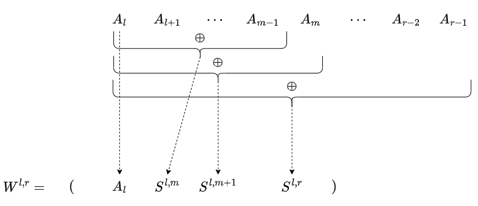
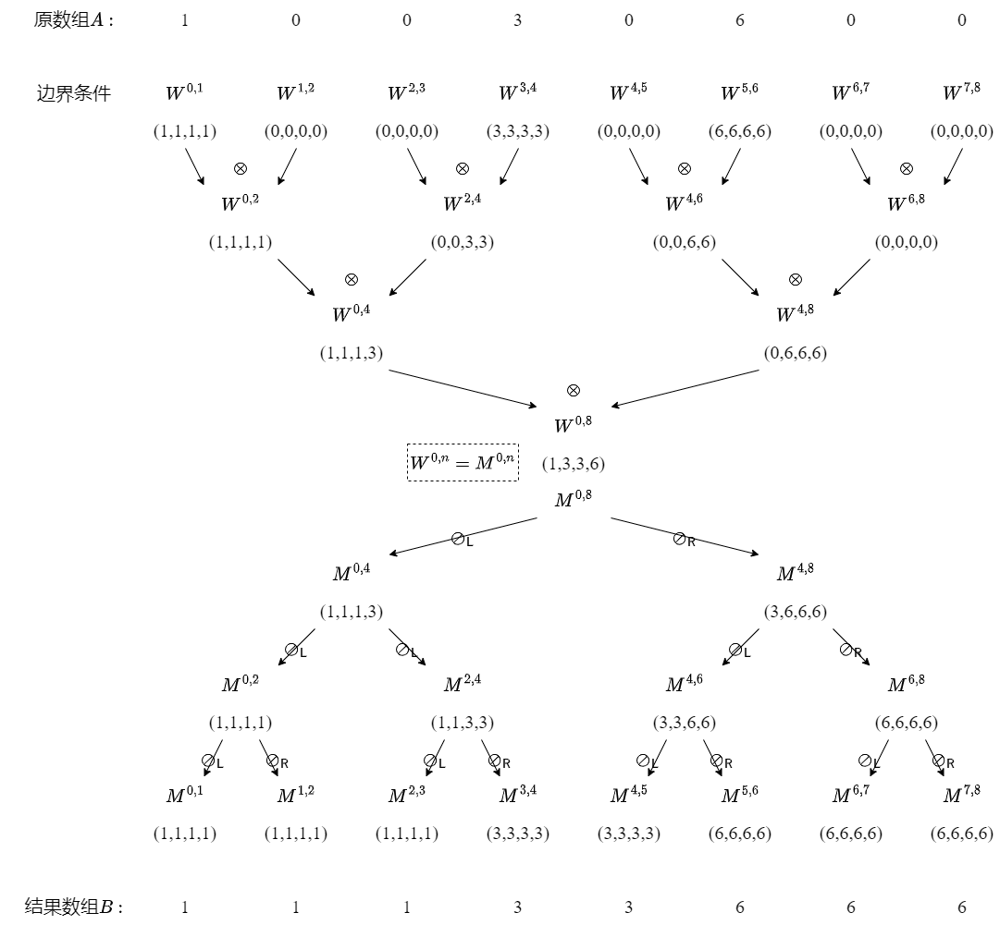
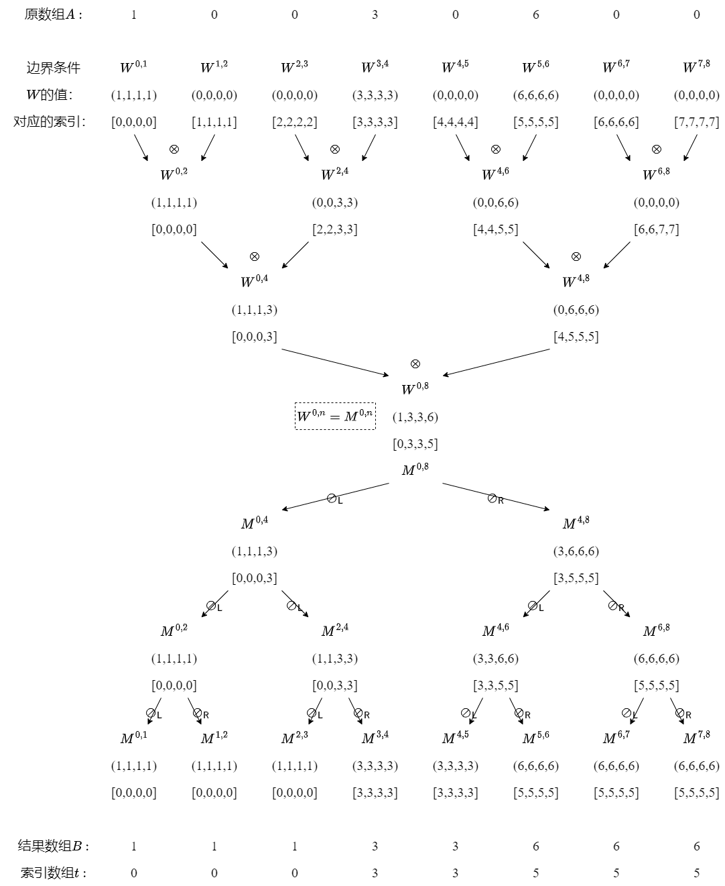

# 问题
考虑对数组$[1, 1, 1, 3, 3, 6, 6, 6]$应用流压缩从而移除重复项，
则可以有以下步骤：

1. $[1, 1, 1, 3, 3, 6, 6, 6]$ <- 原数组
2. $[1, 0, 0, 1, 0, 1, 0, 0]$ <- 标记重复项
3. $[0, 0, 0, 1, 1, 2, 2, 2]$ <- 前缀和(exclusive scan)计算索引数组
4. $[1, 3, 6]$ <- 将原数组中的值按索引数组填入结果数组

接下来考虑逆向该过程。

假设我们除了原数组$[1, 3, 6]$，
还知道一个表示各段出现了多少次的频次数组$[3, 2, 3]$，
则可以有以下逆向步骤：

1. $[3, 2, 3]$ <- 频次数组
2. $[0, 3, 5]$ <- 对频次数组做前缀和(exclusive)，得到索引数组
3. $[1, 3, 6]$ <- 原数组
4. $[1, 0, 0, 3, 0, 6, 0, 0]$ <- 将原数组按索引数组填入结果数组中
5. $[1, 1, 1, 3, 3, 6, 6, 6]$ <- 对结果数组进行向右洪溢(?)得到结果

上述步骤中第4步的“向右洪溢”是需要进一步讨论的复杂步骤。

本文将给出“向右洪溢”的一种reduce-deduce算法，
以及“向右洪溢”的导数计算，
最后将给出封装好的“向右洪溢”的Pytorch Function。

（注：“向右洪溢”是我自己起的名字，如果有人知道其通用名称的话还请告诉我，谢谢。）

# 记号
设原数组（例子中的$[1,0,0,3,0,6,0,0]$）为$V$，
其长度为$n$。

设结果数组（例子中的$[1, 1, 1, 3, 3, 6, 6, 6]$）为$B$。

数组索引从0开始。


# 算法
## 将问题转化为前缀和问题
注意到如果我们定义运算符$\oplus$满足：

$$
x \oplus y = 
\left\{
\begin{aligned}
	&x &\quad \text{if } y = 0 \\
	&y &\quad \text{if } y \neq 0 \\
\end{aligned}
\right.
$$

则结果数组$B$满足：

$$
B_i = A_1 \oplus A_2 \oplus \dots \oplus A_i
$$

所以这其实可以看成是对$\oplus$定义的一个前缀和问题。
我们参照前缀和算法，使用reduce-deduce的方法来解决该问题。

不过注意到$\oplus$和$+$的区别：$\oplus$是不可逆的。
就是说不存在一个“减法”运算符$\ominus$能使得：

$$
	(x\oplus y) \ominus y = x
$$

这是因为当$y\neq 0$时，$x\oplus y$中不包含$x$的任何信息，它完全由$y$定义。
因此我们需要另外定义一种能保留$x$信息的运算符以便能顺利deduce。

我的做法是构造了两种四元组$W^{l, r}, M^{l, r}$，
然后在这两种四元组上定义新的运算符$\otimes, \oslash$分别进行reduce和deduce。

为了方便，我们引入记号$S^{l, r}$来表示在原数组的$[l, r)$区间上应用$\oplus$后的结果，即：

$$
S^{l, r} = A_l \oplus A_{l+1} \oplus \dots \oplus A_{r-1}
$$

## Reduce

首先来看$W^{l, r}$，它在reduce过程中被求值，
表示的是在原数组$[l, r)$这一区间中的部分前缀和结果。
设$m=\frac{l+r}{2}$，有：

$$

W^{l, r} = 
\begin{pmatrix}
	A_l &  S^{l, m} & S^{l, m+1} & S^{l, r} 
\end{pmatrix}

$$

如下图所示：



为了方便，引入记号
$W^{l, r}=\begin{pmatrix}W^{l,r}_l & W^{l,r}_\triangleleft & W^{l,r}_\trianglelefteq & W^{l,r}_\diamond\end{pmatrix}$
，即：

$$
\begin{aligned}

W^{l,r}_l &= A_l \\
W^{l,r}_\triangleleft &= S^{l,m} \\
W^{l,r}_\trianglelefteq &= S^{l, m+1} \\
W^{l,r}_\diamond &= S^{l, r} \\

\end{aligned}
$$

----

下面我们定义运算符$\otimes$使得$W^{l,r} = W^{l,m} \otimes W^{m,r}$，
从而能够对$W^{l,r}$进行reduce过程。

记$L=W^{l,m}, R=W^{m,r}, X=W^{l,r}$。

对$X_l, X_\triangleleft$显然有：

$$
\begin{aligned}
X_l &= A_l &= L_l \\
X_\triangleleft &= S^{l, m} &= L_\diamond
\end{aligned}
$$

而对$X_\trianglelefteq, X_\diamond$，由于$\oplus$满足性质：
$\forall i \in (l, r): S^{l,r} = S^{l,i} \oplus S^{i,r}$，所以可得：

$$
\begin{aligned}
X_\trianglelefteq &= S^{l, m+1} &= S^{l, m} \oplus A_{m} &= L_\diamond \oplus R_l \\

X_\diamond &= S^{l,r} &= S^{l,m} \oplus S^{m,r} &= L_\diamond \oplus R_\diamond \\
\end{aligned}
$$

由此可以得到$\otimes$的定义：

$$
\begin{aligned}
X &= L \otimes R \\
&= \begin{pmatrix}
	L_l & L_\diamond & L_\diamond \oplus R_l & L_\diamond \oplus R_\diamond
\end{pmatrix}
\end{aligned}
$$


## Deduce
然后再是$M^{l,r}$的定义，它是在deduce过程中被求值的，
用于表示在原数组上的前缀和计算结果。
设$m=\frac{l+r}{2}$，有：

$$

M^{l, r} = 
\begin{pmatrix}
	S^{0, l+1} &  S^{0, m} & S^{0, m+1} & S^{0, r} 
\end{pmatrix}

$$

注意$M^{l,r}$和$W^{l,r}$的区别：$W^{l,r}$中的项仅为$[l, r)$范围内的前缀和，而$M^{l,r}$中的项为原数组从头到尾$[0, n)$内的前缀和。

对$M^{l,r}$同样引入记号
$M^{l, r}=\begin{pmatrix}M^{l,r}_l & M^{l,r}_\triangleleft & M^{l,r}_\trianglelefteq & M^{l,r}_\diamond\end{pmatrix}$
，即：

$$
\begin{aligned}

M^{l,r}_l &= S^{0, l+1}\\
M^{l,r}_\triangleleft &= S^{0,m} \\
M^{l,r}_\trianglelefteq &= S^{0, m+1} \\
M^{l,r}_\diamond &= S^{0, r} \\

\end{aligned}
$$


-----
下面我们定义运算符$\oslash_\mathsf{L}, \oslash_\mathsf{R}$使得

$$
M^{l,m}=M^{l,r}\oslash_\mathsf{L} W^{l,m} \\
M^{m,r}=M^{l,r}\oslash_\mathsf{R} W^{m,r}
$$

，从而能够对$M^{l,r}$进行deduce过程。

记$L=M^{l,m}, R=M^{m,r}, X=M^{l,r}$。


首先考虑$L= \begin{pmatrix}
% S^{0, l+1} & S^{0, l_m} & S^{0, l_m+1} & S^{0, m}
L_l & L\triangleleft & L_\trianglelefteq & L_\diamond
\end{pmatrix}$的计算。

对$L_l, L_\diamond$显然有：

$$
\begin{aligned}
L_l &= S^{0, l+1} &= X_l \\
L_\diamond &= S^{0, m} &= X_\triangleleft
\end{aligned}
$$

设$l_m=\frac{l+m}{2}$，考虑
$L_\triangleleft = S^{0, l_m} = S^{0, l+1} \oplus S^{l+1, l_m}$：

1. 注意到$\oplus$具有性质$x \oplus x = x$
2. 因此$S^{l,r}$具有性质$S^{l, i} \oplus S^{i-1, r} = (A_l \oplus \dots \oplus A_{i-1}) \oplus (A_{i-1} \oplus \dots \oplus A_{r-1}) = S^{l,r} = S^{l, i} \oplus S^{i, r}$。
3. 于是可知$L_\triangleleft = S^{0, l+1} \oplus S^{l+1, l_m} = S^{0, l+1} \oplus S^{l, l_m} = X_l \oplus W^{l, m}_\triangleleft$。

同理可知$L_\trianglelefteq = S^{0, l_m+1} = S^{0, l+1} \oplus S^{l, l_m+1} = X_l \oplus W^{l, m}_\trianglelefteq$。

于是有$\oslash_\mathsf{L}$的定义：

$$
\begin{aligned}
L &= X \oslash_\mathsf{L} W^{l,m} \\
&= \begin{pmatrix}
	X_l & X_l \oplus W^{l,m}_\triangleleft & X_l \oplus W^{l, m}_\trianglelefteq & X_\triangleleft
\end{pmatrix}
\end{aligned}
$$

对$\oslash_\mathsf{R}$进行类似的讨论，可以得到其定义：

$$
\begin{aligned}
R &= X \oslash_\mathsf{R} W^{m,r} \\
&= \begin{pmatrix}
	X_\trianglelefteq & X_\trianglelefteq \oplus W^{m, r}_\triangleleft & X_\trianglelefteq \oplus W^{m, r}_\trianglelefteq & X_\diamond
\end{pmatrix}
\end{aligned}
$$


## 边界条件
上文中给出了$W^{l,r}, M^{l,r}$的递推式，
这里我们给出它们的边界条件：

$$
\begin{aligned}
W^{i, i+1} &= \begin{pmatrix}
	A_i & A_i & A_i & A_i
\end{pmatrix} \\

M^{0, n} &= W^{0, n} \\

M^{i, i+1} &= \begin{pmatrix}
	B_i & B_i & B_i & B_i
\end{pmatrix}
\end{aligned}
$$

其中$A$为原数组，$B$为结果数组。


## 例子
有了递推式和边界条件以后就可以进行reduce-deduce过程来求解该前缀和问题了。

这里给出该过程的一个例子：




## 复杂度分析
不难发现reduce-deduce的过程中只会计算$2n-1$次$W^{l,r}$和$M^{l,r}$，并且每次计算都是常数时间$O(1)$，因此总的时间复杂度为$O(n)$。

需要存储的数据为$W^{l,r}$和$M^{l,r}$，它们都只要$O(n)$的空间占用，因此空间复杂度为$O(n)$。


# 导数
除了前缀和的表示以外，结果数组$B$还可以表示为：

$$
B_i = A_{t_i},\quad t_i = max\{j \in [0, i]: A_j \neq 0\}
$$

数组$t_i$为$0,1,\dots, n-1$的一个全排列，它将$B$的索引映射为$A$的索引。
很明显，$B$关于$A$的导数满足下式：

$$
\frac{\partial B_i}{\partial A_j} = 
\left\{
\begin{aligned}
	1 \quad \text{if } j = t_i \\
	0 \quad \text{if } j \neq t_i
\end{aligned}
\right.
$$

而数组$t_i$的计算是简单的，
只要在上文中的reduce-deduce过程中传递一下当前值对应的索引即可。
例如在reduce计算$X_l = L_l$时，
顺便传递一下$L_l$对应的索引给$X_l$就行。

此处不对$t_i$的计算方法做展开，只给出一个算它的例子：




# 实现
具体实现中有几点值得注意的：

* $W^{l,r}$和$M^{l,r}$是可以共享存储的，为它们开一个数组即可。
* 当原数组长度$n$不为2的幂时，可以通过引入哑结点的方式来处理，详情请参阅下文代码。

关于我的代码有几点需要注意的：
* 我的代码中省略掉了$W^{i, i+1}, M^{i, i+1}$的构造，我直接从原数组$A$构造$W^{i, i+2}$和从$M^{i, i+1}$推出结果数组$B$了(`enter`函数和`leave`函数）。
* 我的代码中使用Numba来编写kernel，并将“向右洪溢”这一操作通过继承torch.autograd.Function给集成进了pytorch的自动求导系统中。这部分请参阅[这篇博客](https://zhuanlan.zhihu.com/p/582978353)。


代码我也上传了一份[gist](https://gist.github.com/supplient/8b0fc2bbab89f95df8272024c987fb4e)以便下载。


``` python
import numpy as np
import torch
import numba.cuda as cu

@cu.jit
def enter(upside, down_value, down_index, dumb_R):
	di = cu.grid(1)
	if di >= down_value.shape[0]:
		return
	ui = di * 2

	AV = down_value[di]
	AI = down_index[di]
	L = upside[ui]
	if ui+1 < upside.shape[0]:
		R = upside[ui+1]
	else:
		R = dumb_R

	AV[0] = L[0]
	AI[0] = ui
	AV[1] = L[0]
	AI[1] = ui
	if R[0] != 0:
		AV[2] = R[0]
		AI[2] = ui + 1
		AV[3] = R[0]
		AI[3] = ui + 1
	else:
		AV[2] = L[0]
		AI[2] = ui
		AV[3] = L[0]
		AI[3] = ui

@cu.jit
def up2down(up_value, up_index, down_value, down_index, dumb_R_value, dumb_R_index):
	di = cu.grid(1)
	if di >= down_value.shape[0]:
		return
	ui = di * 2

	AV = down_value[di]
	AI = down_index[di]
	LV = up_value[ui]
	LI = up_index[ui]
	if ui+1 < up_value.shape[0]:
		RV = up_value[ui+1]
		RI = up_index[ui+1]
	else:
		RV = dumb_R_value
		RI = dumb_R_index

	# A0
	AV[0] = LV[0]
	AI[0] = LI[0]

	# A1
	if LV[3] != 0:
		AV[1] = LV[3]
		AI[1] = LI[3]
	elif LV[2] != 0:
		AV[1] = LV[2]
		AI[1] = LI[2]
	elif LV[1] != 0:
		AV[1] = LV[1]
		AI[1] = LI[1]
	else:
		AV[1] = AV[0]
		AI[1] = AI[0]

	# A2
	if RV[0] != 0:
		AV[2] = RV[0]
		AI[2] = RI[0]
	else:
		AV[2] = AV[1]
		AI[2] = AI[1]
	
	# A3
	if RV[3] != 0:
		AV[3] = RV[3]
		AI[3] = RI[3]
	elif RV[2] != 0:
		AV[3] = RV[2]
		AI[3] = RI[2]
	elif RV[1] != 0:
		AV[3] = RV[1]
		AI[3] = RI[1]
	else:
		AV[3] = AV[2]
		AI[3] = AI[2]


@cu.jit
def down2up(down_value, down_index, up_value, up_index):
	ui = cu.grid(1)
	if ui >= up_value.shape[0]:
		return
	di = int(ui / 2)
	is_L = (ui % 2) == 0

	AV = down_value[di]
	AI = down_index[di]
	XV = up_value[ui]
	XI = up_index[ui]

	off = 0 if is_L else 2
	XV[0] = AV[off + 0]
	XI[0] = AI[off + 0]

	if XV[1] == 0:
		XV[1] = XV[0]
		XI[1] = XI[0]

	if XV[2] == 0:
		XV[2] = XV[1]
		XI[2] = XI[1]

	XV[3] = AV[off + 1]
	XI[3] = AI[off + 1]

@cu.jit
def leave(down_value, down_index, up_value, up_index):
	ui = cu.grid(1)
	if ui >= up_value.shape[0]:
		return
	di = int(ui / 2)
	is_L = (ui % 2) == 0

	AV = down_value[di]
	AI = down_index[di]
	XV = up_value[ui]
	XI = up_index[ui]

	off = 0 if is_L else 2
	XV[0] = AV[off]
	XI[0] = AI[off]


block_size = 256
def cal_block_num(n):
	if n == 0: return 0
	return (int)((n-1)/block_size)+1

def gpu_solve(x: torch.Tensor):
	# x must be 1-D tensor

	# Reshape to 2-D tensor
	x = x.reshape((*x.shape, 1))

	dn_list = []
	dn = x.shape[0]
	while True:
		dn = (int)((dn+1)/2)
		dn_list.append(dn)
		if dn == 1:
			break
	dn_sum = np.sum(dn_list)

	# Init d & dumb_R
	d_value = torch.empty((dn_sum, 4), dtype=x.dtype, device="cuda")
	d_index = torch.empty((dn_sum, 4), dtype=torch.int, device="cuda")
	dumb_R_enter = torch.zeros((1), dtype=x.dtype, device="cuda")
	dumb_R_value_up2down = torch.zeros((4), dtype=x.dtype, device="cuda")
	dumb_R_index_up2down = torch.zeros((4), dtype=torch.int, device="cuda")

	def get_d(left, right):
		left = min(int(left), d_value.shape[0])
		right = min(int(right), d_value.shape[0])
		return d_value[left:right], d_index[left:right]

	enter[cal_block_num(dn_list[0]), block_size](x, *get_d(0, dn_list[0]), dumb_R_enter)

	left = 0
	right = dn_list[0]
	for i in range(1, len(dn_list)):
		length = dn_list[i]
		nleft = right
		nright = nleft + length
		up2down[cal_block_num(length), block_size](*get_d(left, right), *get_d(nleft, nright), dumb_R_value_up2down, dumb_R_index_up2down)
		left = nleft
		right = nright

	for i in range(len(dn_list)-2, -1, -1):
		length = dn_list[i]
		nright = left
		nleft = nright - length
		down2up[cal_block_num(length), block_size](*get_d(left, right), *get_d(nleft, nright))
		left = nleft
		right = nright

	y_value = torch.empty_like(x, device="cuda")
	y_index = torch.empty_like(x, device="cuda")
	leave[cal_block_num(x.shape[0]), block_size](*get_d(0, dn_list[0]), y_value, y_index)
	y_value = y_value.reshape(y_value.shape[:-1])
	y_index = y_index.reshape(y_index.shape[:-1])
	return y_value, y_index


def cpu_solve(x):
	y = torch.empty_like(x)
	yi2xi = torch.empty_like(x, dtype=int)
	for i in range(0, x.shape[0]):
		if x[i] == 0:
			y[i] = y[i-1]
			yi2xi[i] = yi2xi[i-1]
		else:
			y[i] = x[i]
			yi2xi[i] = i
	return y, yi2xi


@cu.jit
def sum_grad(grad_x, grad_y, yi2xi):
	yi = cu.grid(1)
	if yi < grad_y.shape[0]:
		xi = yi2xi[yi]
		cu.atomic.add(grad_x, xi, grad_y[yi])

class RightFloodFunction(torch.autograd.Function):
	''' 
	## Parameter
	* `x`: must be a 1-D tensor.

	## Return
	* `y`: a 1-D tensor

	## Example
	In  >>> [1, 0, 0, 0, 3, 0, 2, 0, 0, 5, 2]
	Out <<< [1, 1, 1, 1, 3, 3, 2, 2, 2, 5, 2]

	In  >>> [0, 0, 3, 0, 3]
	Out <<< [0, 0, 3, 3, 3]
	'''
	@staticmethod
	def forward(ctx, x: torch.Tensor):
		if x.is_cuda:
			_req_memo = [x.requires_grad]
			x.requires_grad = False
			y, yi2xi = gpu_solve(x)
			x.requires_grad, = _req_memo
		else:
			y, yi2xi = cpu_solve(x)

		ctx.save_for_backward(x, yi2xi)
		return y

	@staticmethod
	def backward(ctx, grad_y: torch.Tensor):
		x, yi2xi = ctx.saved_tensors
		grad_x = None

		if ctx.needs_input_grad[0]:
			grad_x = torch.zeros_like(grad_y, device=grad_y.device)

			if grad_y.is_cuda:
				_req_memo = [grad_y.requires_grad]
				grad_y.requires_grad = False
				sum_grad[cal_block_num(grad_y.shape[0]), block_size](grad_x, grad_y, yi2xi)
				grad_y.requires_grad, = _req_memo
			else:
				for yi in range(grad_y.shape[0]):
					xi = yi2xi[yi]
					grad_x[xi] += grad_y[yi]

		return grad_x
rightflood = RightFloodFunction.apply


if __name__ == "__main__":
	x = torch.tensor([1, 0, 0, 3, 0, 6, 0, 0], dtype=torch.float, device="cuda", requires_grad=True)
	y = rightflood(x)
	print(x)
	print(y)
	# Output:
	# [1, 0, 0, 3, 0, 6, 0, 0]
	# [1, 1, 1, 3, 3, 6, 6, 6]

	if x.grad:
		x.grad.zero_()
	f = torch.sum(y)
	f.backward()
	print(x.grad)
	# Output:
	# [3, 0, 0, 2, 0, 3, 0, 0]
```

附带一提我的[《并行统计单增数组的元素出现次数》](https://zhuanlan.zhihu.com/p/582291331)一文中也用了类似的reduce-deduce方法来并行实现，
可能任何可以转换成前缀和问题的都可以用reduce-deduce的方法来解决？
感兴趣的可以参阅一下。
（不过那篇里面我写得可能没这篇容易懂……）


**本文依据[CC BY 4.0许可证](https://creativecommons.org/licenses/by/4.0/deed.en)进行授权**


