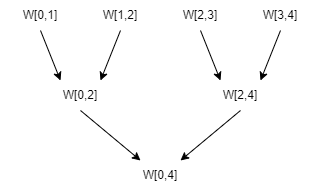
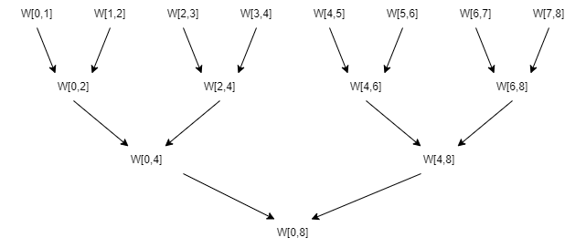
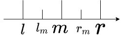
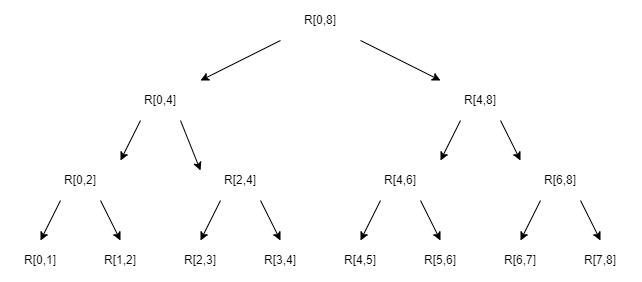
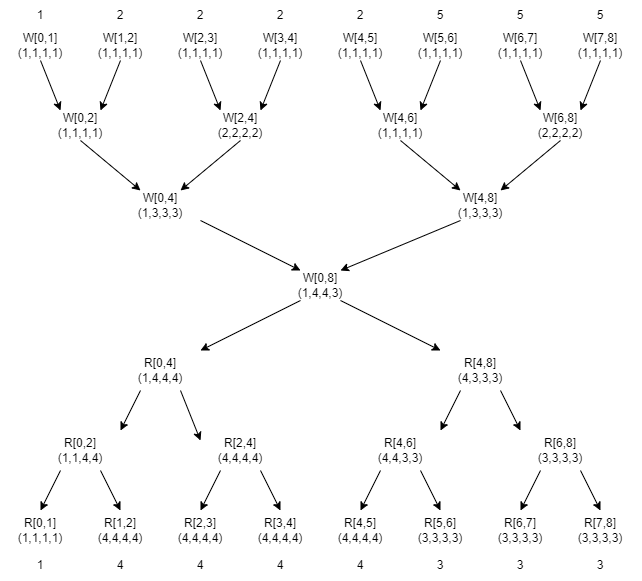

# 问题
* 输入：单调递增的正整数数组$A$
* 输出：数组$B$，其中$B_i$为$A_i$在$A$中的出现次数。

例如：

* 输入：$[1,1,1,2,2,2,2,3]$
* 输出：$[3,3,3,4,4,4,4,1]$

记号规定：
* 索引从0开始

# 递归关系的推导
我们用$S_i^{l,r}$表示在$[l, r)$范围内$A_i$出现的次数：

$$
S_i^{l, r} = \sum_{j \in [l, r)}
	\left\{
	\begin{aligned}
	1 & \text{  ,if } A_i = A_j \\
	0 & \text{  ,if } A_i \neq A_j \\
	\end{aligned}
	\right.
$$

例如对于$A=[1,2,2,2]$而言，$A_2=2, S^{0, 4}_2=3, S^{2, 4}_2=2$；$A_0=1, S^{0, 4}_0=1, S^{0, 2}_0=1$。显然$B_i=S^{0,n}_i$，$n$为数组长度。

假设$l,r$都为2的幂次，显然$S^{l, r}_i$满足递归关系：

$$
S^{l, r}_i = S_i^{l, m} + S_i^{m, r}
$$

其中$m=\frac{l+r}{2}$。


考虑一个四元组：

$$
W^{l, r}=(S^{l,r}_l, S^{l,r}_{m-1}, S^{l,r}_m, S^{l,r}_{r-1})
$$

注意到$S_l^{l, r}$满足：

$$
\begin{aligned}
S_l^{l, r}
&= S_l^{l, m} + S_l^{m, r} & [\text{递归关系}] \\
&= 
	\left\{
	\begin{aligned}
	&S_l^{l, m} + &S_m^{m, r} & \text{  ,if } A_l = A_m, \\
	&S_l^{l, m}   &           & \text{  ,otherwise}  \\
	\end{aligned}
	\right.
& [A\text{单调递增}]
\end{aligned}
$$

第二步是因为$A$单调递增，所以如果$A_l \neq A_m$的话，由$l<m$，可得$A_l < A_m$，从而有$\forall j \in [m,r): A_l < A_m \leq A_j \Rightarrow A_l \neq A_m$。
简单来说就是连$A_m$都大于$A_l$了，那比$A_m$还大的数更不可能等于$A_l$了。
因此当$A_l \neq A_m$时，区间$[m,r)$中没有任何一项等于$A_l$，即$S^{m, r}_l = 0$。


同理，对另外三项也有：

$$
\begin{aligned}
\begin{aligned}
S_l^{l, r} &=
	\left\{
	\begin{aligned}
	&S_l^{l, m} + &S_m^{m, r} & \text{  ,if } A_l = A_m, \\
	&S_l^{l, m}   &           & \text{  ,otherwise}  \\
	\end{aligned}
	\right.
	\\

S^{l,r}_{m-1} &= 
	\left\{
	\begin{aligned}
	&S_{m-1}^{l, m} + &S_m^{m, r} & \text{  ,if } A_{m-1} = A_m, \\
	&S_{m-1}^{l, m}   &           & \text{  ,otherwise}  \\
	\end{aligned}
	\right.
	\\

S^{l,r}_m &=
	\left\{
	\begin{aligned}
	S_{m-1}^{l, m} + S_m^{m, r} & \text{  ,if } A_{m-1} = A_m, \\
	S_m^{m, r} & \text{  ,otherwise}  \\
	\end{aligned}
	\right.
	\\

S^{l,r}_{r-1} &=
	\left\{
	\begin{aligned}
	S_{m-1}^{l, m} + S_{r-1}^{m, r} & \text{  ,if } A_{m-1} = A_{r-1}, \\
	S_{r-1}^{m, r} & \text{  ,otherwise}  \\
	\end{aligned}
	\right.
	\\
\end{aligned}

& \text{  [1]}
\end{aligned}
$$

注意到等式右边的项都在四元组$W^{l, m}$或$W^{m, r}$中，也就是说上面这组等式描述了四元组$W^{l, r}$关于$W^{l, m}, W^{m, r}$的递归关系。


# 算法
考虑数组长度为4的情况，以$W^{i, i+1}$为边界条件，按照式1归纳计算$W^{0, 2}, W^{2, 4}, W^{0, 4}$：



在归纳过程中4个$S_{i}^{0, 4}$都计算完了，都在四元组$W^{0, 4}$中。

接下来再考虑复杂一点的数组长度为8的情况，归纳计算的方法没有任何变化：



不过这次$W^{0, 8}$里只包含了$S^{0, 8}_0, S^{0, 8}_3, S^{0, 8}_4, S^{0, 8}_7$这四项，还有$S^{0, 8}_1, S^{0, 8}_2, S^{0, 8}_5, S^{0, 8}_6$这四项需要求解。

以$S^{0, 8}_1$为例：
* 如果$A_1 = A_4$，则$S^{0, 8}_1=S^{0,8}_4$，而$S^{0,8}_4$已知，因此完成求解；
* 如果$A_1 \neq A_4$，则由$A$的单调递增性质必有$S^{4,8}_1=0$，所以由$S_i^{l, r}$的递推关系可知$S^{0,8}_1 = S^{0,4}_1 + S^{4,8}_1 = S^{0,4}_1$，而$S^{0,4}_1$已知，完成求解。

其他三项的讨论过程也类似。

我们可以将该过程一般化。
设$l_m=\frac{l+m}{2}, r_m=\frac{m+r}{2}$，索引关系如下图所示：



则在已知四元组$W^{l, r}=(S^{l,r}_l, S^{l,r}_{m-1}, S^{l,r}_m, S^{l,r}_{r-1})$时，可以得到递推关系：

$$

\begin{aligned}
\begin{aligned}

S^{l, r}_{l_m-1} &= 
	\left\{
	\begin{aligned}
	&S^{l, r}_m       & \text{  if } A_{l_m-1} = A_m \\
	&S^{l, m}_{l_m-1} & \text{  otherwise} \\
	\end{aligned}
	\right.
	\\

S^{l, r}_{l_m} &= 
	\left\{
	\begin{aligned}
	&S^{l, r}_m       & \text{  if } A_{l_m} = A_m \\
	&S^{l, m}_{l_m} & \text{  otherwise} \\
	\end{aligned}
	\right.
	\\

S^{l, r}_{r_m-1} &= 
	\left\{
	\begin{aligned}
	&S^{l, r}_{m-1}      & \text{  if } A_{r_m-1} = A_{m-1} \\
	&S^{m, r}_{r_m-1} & \text{  otherwise} \\
	\end{aligned}
	\right.
	\\

S^{l, r}_{r_m} &= 
	\left\{
	\begin{aligned}
	&S^{l, r}_{m-1}      & \text{  if } A_{r_m} = A_{m-1} \\
	&S^{m, r}_{r_m} & \text{  otherwise} \\
	\end{aligned}
	\right.
	\\

\end{aligned}

& \text{  [2]}

\end{aligned}

$$

注意到上式中$S^{l, m}_{l_m-1}, S^{l, m}_{l_m}, S^{m, r}_{r_m-1}, S^{m, r}_{r_m}$这些项在归纳计算$W^{l, r}$时都已经被算出来了，存储在了$W^{l,m}, W^{m,r}$中。

接下来我们构造一个四元组以便简洁地表示上式所描述的递推关系。
设数组总长为$n$，设四元组$R^{l, r}$为：

$$
R^{l,r} = (S^{0,n}_l, S^{0,n}_{m-1}, S^{0,n}_m, S^{0,n}_{r-1})
$$

其中$m=\frac{l+r}{2}$。

注意$R^{l,r}$和$W^{l,r}$的区别：$R^{l,r}$记录的是第$l, m-1, m, r-1$项在整个数组上的出现次数，而$W^{l, r}$记录的仅为$[l,r)$这个范围内的这些项的出现次数。

不难发现$R^{0, n} = W^{0, n}$，且式2描述了$R^{l,m}, R^{m,r}$关于$R^{l,r}, W^{l,m}, W^{m,r}$的递推关系。

以数组长度为8的情况为例，在已知$W^{l,r}, R^{0,n}$的前提下按照式2进行演绎计算：



（事实上，图中不用全算，根据前文对数组长度为4的情况的讨论，算到$R^{0,4}, R^{4,8}$时其实就已经得到所有$S^{0,8}_i$了）

注意，图中为了简洁所以只列出了$R^{l,r}$，但$W^{l,r}$也是演绎过程中的必要信息。


# 例子



TODO:
* 讲解一下例子（不一定会做）


# 并行性能的分析
上述算法非常适合并行实现，归纳过程和演绎过程中的每一层中的各个节点之间都不存在数据竞争的问题，因此每一层内都可以并行。
不过层与层之间还是得串行实现就是了。

观察归纳过程和演绎过程，不难发现节点数为$2n$（$n$为数组长度），且每个节点的计算时间都为$O(1)$，因此总的时间复杂度为$O(n)$。


# 实现
具体实现中$W^{l,r}$和$R^{l,r}$可以用同一个数组来存储。
还可以多用一个数组来存储$(A_l, A_{m-1}, A_m, A_r)$来方便编程。

* 我的实现中用`d`来存储$W^{l,r}$（和$R^{l,r}$）
* 我将$(A_l, A_{m-1}, A_m, A_r)$也并进了`d`中，将它的前四个分量用来存$(A_l, A_{m-1}, A_m, A_r)$，后四个分量用来存$W^{l,r}$
* 我称归纳过程为`up2down`，称演绎过程为`down2up`
* 我的实现中允许数组长度不是2的幂的情况，代价是我引入了一个用于当作哑结点的`dumb_R`和一些琐碎的索引检查。
* 空间占用为$O(n)$，`d`的长度为$n$
* 使用[numba](https://numba.pydata.org/)来编写kernel
* 不熟悉这套归纳演绎流程的人可以先看看[gpugems里的前缀和](https://developer.nvidia.com/gpugems/gpugems3/part-vi-gpu-computing/chapter-39-parallel-prefix-sum-scan-cuda)

代码（[gist](https://gist.github.com/supplient/4a9815fb0c3fff6b6e44db98449c6806)上也放了一份方便拷贝）：

``` python
import numpy as np
import torch
import numba.cuda as cu

@cu.jit
def enter(upside, downside):
	di = cu.grid(1)
	if di >= downside.shape[0]:
		return
	ai = di * 2

	I = downside[di, 0:4]
	S = downside[di, 4:8]
	li  = upside[ai]
	ri = 0 if ai+1 >= upside.shape[0] else upside[ai+1]

	I[0] = li
	I[1] = li
	I[2] = ri
	I[3] = ri

	ls = 1 if li != ri else 2
	rs = 1 if li != ri else 2

	S[0] = ls
	S[1] = ls
	S[2] = rs
	S[3] = rs


@cu.jit
def up2down(upside, downside, dumb_R):
	di = cu.grid(1)
	if di >= downside.shape[0]:
		return
	ui = di * 2

	A = downside[di]
	L = upside[ui]
	if ui+1 < upside.shape[0]:
		R = upside[ui+1]
	else:
		R = dumb_R

	AI = A[0:4]
	AS = A[4:8]
	LI = L[0:4]
	LS = L[4:8]
	RI = R[0:4]
	RS = R[4:8]

	AI[0] = LI[0]
	AI[1] = LI[3]
	AI[2] = RI[0]
	AI[3] = RI[3]

	AS[0] = LS[0]
	AS[0] += RS[0] if AI[0] == RI[0] else 0

	AS[1] = LS[3]
	AS[1] += RS[0] if AI[1] == RI[0] else 0

	AS[2] = RS[0]
	AS[2] += LS[3] if AI[2] == LI[3] else 0

	AS[3] = RS[3]
	AS[3] += LS[3] if AI[3] == LI[3] else 0


@cu.jit
def down2up(downside, upside):
	ui = cu.grid(1)
	if ui >= upside.shape[0]:
		return
	di = int(ui / 2)
	off = (ui % 2) * 2

	A = downside[di]
	X = upside[ui]

	AI = A[0+off:2+off]
	AS = A[4+off:6+off]

	XI = X[0:4]
	XS = X[4:8]

	for i in range(4):
		for j in range(2):
			if XI[i] == AI[j]:
				XS[i] = AS[j]
				break


@cu.jit
def leave(downside, upside):
	ai = cu.grid(1)
	if ai >= upside.shape[0]:
		return
	di = int(ai / 2)
	off = (ai % 2) * 2

	upside[ai] = downside[di, 4+off]


block_size = 256
def cal_block_num(n):
	if n == 0: return 0
	return (int)((n-1)/block_size)+1

def gpu_solve(a):
	a = torch.tensor(a, device="cuda")

	dn_list = []
	dn = a.shape[0]
	while True:
		dn = (int)((dn+1)/2)
		dn_list.append(dn)
		if dn == 1:
			break
	dn_sum = np.sum(dn_list)

	d = torch.empty((dn_sum, 8), device="cuda")
	dumb_R = torch.zeros((8), device="cuda")

	def get_d(left, right):
		left = min(int(left), d.shape[0])
		right = min(int(right), d.shape[0])
		return d[left:right]

	enter[cal_block_num(dn_list[0]), block_size](a, get_d(0, dn_list[0]))

	left = 0
	right = dn_list[0]
	for i in range(1, len(dn_list)):
		length = dn_list[i]
		nleft = right
		nright = nleft + length
		up2down[cal_block_num(length), block_size](get_d(left, right), get_d(nleft, nright), dumb_R)
		left = nleft
		right = nright

	for i in range(len(dn_list)-2, -1, -1):
		length = dn_list[i]
		nright = left
		nleft = nright - length
		down2up[cal_block_num(length), block_size](get_d(left, right), get_d(nleft, nright))
		left = nleft
		right = nright

	leave[cal_block_num(a.shape[0]), block_size](get_d(0, dn_list[0]), a)
	return a


def cpu_solve(a):
	import copy
	a = copy.copy(a)
	memo = {}
	for x in a:
		if not x in memo.keys():
			memo[x] = 0
		memo[x] += 1
	for i in range(len(a)):
		a[i] = memo[a[i]]
	return a


if __name__ == "__main__":
	import random
	n = 1000
	a = []
	i = 1
	while len(a) < n:
		delta = random.randint(1, n-len(a))
		a.extend([i] * delta)
		i += 1
	# a = [1, 1, 1, 2, 2, 2, 2, 3, 3]
	a = np.array(a)

	print("CPU solving...")
	cpu_res = cpu_solve(a)
	print("GPU solving...")
	gpu_res = gpu_solve(a).cpu().numpy()

	print("Origin:\t" + str(a))
	print("CPU:\t" + str(cpu_res))
	print("GPU:\t" + str(gpu_res))

	if np.any(~np.equal(cpu_res, gpu_res)):
		print("!!!!Failed!!!!")
	else:
		print("Succeed")
```


TODO:
* 写一个notebook来讲解一下代码（不一定会做）


