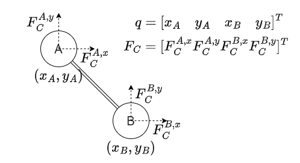

Think about a constrained particle system(rigid body system is just a constrained particle system).

Use $q$ for the position vector of the whole system.
And the constraint is just a function: $C(q)=0$.

# Condition 1
Constraint $C=0$ should be kept at all the time.

If we assume $C|_{t=0}=0, \dot{C}|_{t=0}=0$, then all we need is to make sure:

$$
\ddot{C}(t)=0, \forall t
$$

# Condtion 2
Constraint force $F_C$ should not do work.

Let $\delta q$ be some small delta for $q$ which keep $C=0$:

$$C(q)=0 \Rightarrow C(q+\delta q) = 0$$

Then to make constraint force $F_C$ don't do any work under $\delta q$, it should be perpendicular with $\delta q$:

$$F_C \perp \delta q$$

For the arbitraryness of $\delta q$, $F_C$ must be parallel with the normal vector of the surface $C(q)=0$:

$$
F_C = \nabla C^T \lambda
$$

where $\nabla C = \frac{\partial C}{\partial q}$ is the Jacobian of $C$ about $q$.

# Motion Equation
By Newton's second law of motion $F=am$, we have:

$$
F_C + F_E = Ma
$$

where

* $F_C$ is constraint force
* $F_E$ is external force
* $M$ is the mass matrix
* $a$ is the acceleration

# System to solve
Now combine Condition 1&2 and the motion equation, we have:

$$
\left\{
\begin{aligned}

\ddot{C}(t)=0, \forall t \\
F_C = \nabla C^T \lambda \\
F_C + F_E = Ma

\end{aligned}
\right.
$$

where $F_C, \lambda, a$ are unknowns.

If $q$ is $n$-dim and $C$ is $m$-dim, then:

* Condition 1 provides $m$ equations
* Condition 2 provides $n$ equations
* Motion Equation provides $n$ equations
* $F_C, \lambda, a$ have $n+m+n$ unknowns

So the system has an unique solution (if exists).

# Example

Notations are shown in the above figure.

Let the constraint be

$$
C(t) = \begin{bmatrix}
	x_A \\
	y_A \\
	(x_B-x_A, y_B-y_A)^2-2
\end{bmatrix}
= \mathbb{0}
$$

Let the external force be

$$
F_E = \begin{bmatrix}
	0 \\
	-g \\
	0 \\
	-g
\end{bmatrix}
$$

where $g$ is the gravitational constant.

Let mass be

$$
M = \begin{bmatrix}
	m_A & 0 & 0 & 0 \\
	0 & m_A & 0 & 0 \\
	0 & 0 & m_B & 0 \\
	0 & 0 & 0 & m_B \\
\end{bmatrix}
$$

where $m_A, m_B$ are the mass of A and B.

Put these into the system above(repeated here for convenience):

$$
\left\{
\begin{aligned}

\ddot{C}(t)=0 \\
F_C = \nabla C^T \lambda \\
F_C + F_E = Ma

\end{aligned}
\right.
$$

where let $q_B = (x_B, y_B), q_A=(x_A, y_A)$, we have:

$$
\ddot{C}(t) = \begin{bmatrix}
	a_A \\
	2(v_B-v_A)^2 + 2(q_B-q_A) \cdot (a_B - a_A)
\end{bmatrix}
$$

$$
\nabla C^T = \left[\begin{matrix}1 & 0 & 0 & 0\\0 & 1 & 0 & 0\\2 x_{A} - 2 x_{B} & 2 y_{A} - 2 y_{B} & - 2 x_{A} + 2 x_{B} & - 2 y_{A} + 2 y_{B}\end{matrix}\right]
$$

And if we assume

$$
\begin{aligned}
	q_A = (0, 0) \\
	q_B = (1, -1) \\
	v_A = (0, 0) \\
	v_B = (0, 0) \\
	m_A = 1 \\
	m_B = 1 \\
\end{aligned}
$$

After solving the system equations, the solution is:

$$
\begin{aligned}
	\lambda = \begin{bmatrix}
		-\frac{g}{2} \\
		\frac{3g}{2} \\
		-\frac{g}{4} \\
	\end{bmatrix} \\
	F_C = \begin{bmatrix}
		0 \\
		g \\
		-\frac{g}{2} \\
		\frac{g}{2} \\
	\end{bmatrix} \\
	a = \begin{bmatrix}
		0 \\
		0 \\
		-\frac{g}{2} \\
		-\frac{g}{2} \\
	\end{bmatrix}
\end{aligned}
$$

If we leave $q$ and $v$ be variables, we can get the solution for $a$ (very complex, maybe in vector form will be better):

$$
a_B^x =
\frac{g x_{A} y_{A} - g x_{A} y_{B} - g x_{B} y_{A} + g x_{B} y_{B} + \left(v^{1}_{A}\right)^{2} x_{A} - \left(v^{1}_{A}\right)^{2} x_{B} - 2 v^{1}_{A} v^{1}_{B} x_{A} + 2 v^{1}_{A} v^{1}_{B} x_{B} + \left(v^{2}_{A}\right)^{2} x_{A} - \left(v^{2}_{A}\right)^{2} x_{B} - 2 v^{2}_{A} v^{2}_{B} x_{A} + 2 v^{2}_{A} v^{2}_{B} x_{B} + \left(v^{1}_{B}\right)^{2} x_{A} - \left(v^{1}_{B}\right)^{2} x_{B} + \left(v^{2}_{B}\right)^{2} x_{A} - \left(v^{2}_{B}\right)^{2} x_{B}}{x_{A}^{2} - 2 x_{A} x_{B} + x_{B}^{2} + y_{A}^{2} - 2 y_{A} y_{B} + y_{B}^{2}}

$$

$$
a_B^y = 
\frac{- g x_{A}^{2} + 2 g x_{A} x_{B} - g x_{B}^{2} + \left(v^{1}_{A}\right)^{2} y_{A} - \left(v^{1}_{A}\right)^{2} y_{B} - 2 v^{1}_{A} v^{1}_{B} y_{A} + 2 v^{1}_{A} v^{1}_{B} y_{B} + \left(v^{2}_{A}\right)^{2} y_{A} - \left(v^{2}_{A}\right)^{2} y_{B} - 2 v^{2}_{A} v^{2}_{B} y_{A} + 2 v^{2}_{A} v^{2}_{B} y_{B} + \left(v^{1}_{B}\right)^{2} y_{A} - \left(v^{1}_{B}\right)^{2} y_{B} + \left(v^{2}_{B}\right)^{2} y_{A} - \left(v^{2}_{B}\right)^{2} y_{B}}{x_{A}^{2} - 2 x_{A} x_{B} + x_{B}^{2} + y_{A}^{2} - 2 y_{A} y_{B} + y_{B}^{2}}
$$