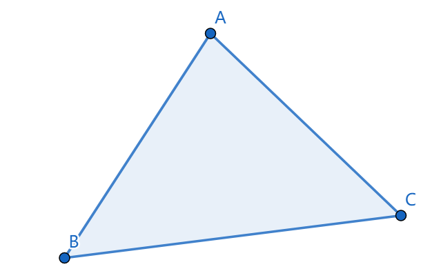
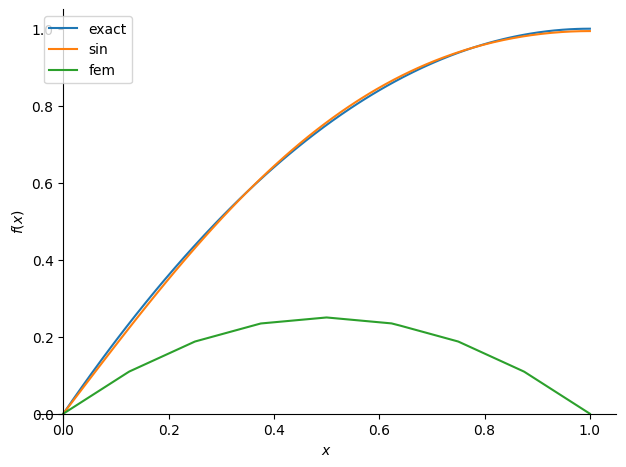

本文为[1]的阅读笔记，将重点介绍 **伽辽金法** 和 **有限元基函数** ，并会给出两个使用三角函数和有限元基函数构造试空间，进而使用伽辽金法求解边值问题的例子（使用sympy编写，可以直接在colab上执行）。

本文的目标受众为 **初学有限元的计算机从业人员** ，并不适合力学专业的相关人士阅读。

注意尽管边界条件的讨论占据了本文很大的篇幅，但其实笔者也尚未完全搞懂边界条件的处理方法，因此读者应当**避免**花太多精力阅读边界条件的部分。

# 1. 伽辽金法

## 1.1 边值问题

欲求解**边值问题**([Boundary value problem](https://en.wikipedia.org/wiki/Boundary_value_problem))：

$$
\left\{
\begin{aligned}
	\mathcal{L}(u) &= 0, \quad x \in \Omega \\
	\mathcal{B_i}(u) &= 0, \quad i=1,2,\dots, n_B
\end{aligned}
\right.
$$

其中$\mathcal{L}(u)=0$为微分方程，例如$\mathcal{L}(u)=f+u''$；$\mathcal{B}_i(u)=0$为边界条件，例如$\mathcal{B}_i(u)=u(x_i)-g(x_i)$；$\Omega$为定义域；$u$为关于$x$的未知函数。

理想目标是找到满足边值问题的$u$。

## 1.2. 求解策略：试函数法

我们采取的求解策略是在**试空间(trial space)**$V$中找一个完全满足边界条件$\mathcal{B}_i(u)=0$、并尽可能满足微分方程$\mathcal{L}(u)=0$的近似解$u\in V$（被称为**试函数trial function**）。

例如试空间可能是$V=\{kx+b: k,b \in R\}$，
显然，能被该空间完全满足的微分方程并不多，
例如微分方程$u''=2$就永远不可能在$V=\{kx+b: k,b \in R\}$中找到解，因为$(kx+b)''\equiv 0$。

设边值问题的精确解为$u_e$，
我们的期望是近似解能尽可能地接近精确解，即它俩的差在某种模下尽可能小：$\min_{u\in V}||u_e-u||$。

但我们不知道精确解$u_e$的解析式，所以没法直接求$\argmin_{u\in V}||u_e-u||$。

## 1.3 Céa引理、变分形式与伽辽金法

[**Céa引理**](https://en.wikipedia.org/wiki/C%C3%A9a%27s_lemma)（见[2]的2.8.1）指出当一些有关$u$和边值问题的条件被满足时，有：

$$
||u_e-u|| \leq C\min_{v\in V} ||u_e-v|| , \quad C \text{ is constant}
$$

即近似解$u$关于$V$中的最优解呈线性关系。
因此我们的目标可以转为找到满足Céa引理条件的$u$。

Céa引理的条件比较复杂，我们一般也不会去验证，所以这里我们只挑选其中最重要的一条，它对我们计算近似解$u$有用：

$$
\begin{aligned}
R := &\mathcal{L}(u) \\
(R,v) &= 0 \quad \forall v \in V \\
\end{aligned}
$$

其中$(R,v) = \int_\Omega Rv dx$为函数内积（或称为$L^2$内积）。

也就是将近似解$u$代入微分方程$\mathcal{L}$后得到的 **残值(Residual)** $R$要与$V$中的任意函数$v$都内积为0（即$R$与$V$正交）。

通常称$(R,v)=0, \forall v \in V$为原边值问题的 **变分形式(variational formulation)** ，
并称通过求解该变分形式来获取原边值问题的近似解的方法为**伽辽金法(Garlekin Method)** 。

> 伽辽金法是一种**加权残值法(Weighted Residual Method)** 。
> 加权残值法也是求解变分形式来获取近似解，不过它的变分形式为：
> $$
> (R,v) = 0 \quad \forall v \in W
> $$
> 其中$W$为有别于试空间$V$的另一个空间，它被称为*test space*，而$v\in W$被称为*test function*。
> 伽辽金法就是当$W=V$时的加权残值法。

## 1.4. 强形式与弱形式

通过对$(R,v)$应用分部积分，有时可以降低对试函数$u$的可导性要求。
例如当$\mathcal{L}(u)=u'', \Omega=[0,1]$时：

$$
\begin{aligned}
(R, v) &= \int_\Omega u''vdx \\
&= \int_\Omega vdu' \\
&= \int_\Omega u'v'dx + u'v|^1_0 \\
\end{aligned}
$$

可以看到，原本$(R,v)$的计算要求$u$有二阶导数$u''$，但在经过一步分部积分后就只要一阶导数$u'$了。

一般地，我们将$(R,v)=0$经过分部积分后得到的形式称为**弱形式(weak formulation)** ，记为：

$$
F(u;v)=0 \quad \forall v \in V
$$

而原本那个有更高可导性要求的形式则称为 **强形式(strong formulation)** 。
强形式和弱形式都是变分形式，只是对试函数$u$的可导性要求不同而已。

特别地，实际问题中经常碰到满足双线性性质的$F(u;v)$，即满足如下性质的$F(u;v)$：

$$
\begin{aligned}
F(u+w;v) &= F(u;v) + F(w;v) \\
F(u;v+w) &= F(u;v) + F(u;w) \\
\end{aligned}
$$

称满足该性质的$F(u;v)$为双线性形式(bilinear form)，此时弱形式更常见的记法为（后文中我们将称其为*线性弱形式*，这是一个非标准术语）：

$$
a(u,v) = L(v) \quad \forall v \in V
$$

其中$a(u,v)$为双线性形式，$L(v)$为线性形式，即满足$L(v+w)=L(v)+L(w)$。

### 1.4.1. 有限维试空间与线性弱形式

通常，为了提升计算效率，我们会选择有限维的试空间，
即试空间为一个线性空间，且该线性空间中的基为一组有限个数的函数。
设试空间为$V$，基函数为$\{\phi_i\}$，则有$\forall v \in V$：

$$
v = \sum c_i \phi_i
$$

在实际问题中我们还经常会碰到线性弱形式：

$$
a(u,v) = L(v) \quad \forall v \in V
$$

设$u = \sum c_i \phi_i$。
为了能求解弱形式，我们需要将它转化为一个以$\{c_i\}$为未知数的有限的方程组。
为此需要证明下列等价关系：

$$
\begin{aligned}
& a(u,v) = L(v) \quad \forall v \in V \\
\Leftrightarrow
& \sum c_i a(\phi_i, \phi_j) = L(\phi_j) \quad \forall j \\
\end{aligned}
$$

先对$a(u, v)$做一个变换（由$a(\cdot, \cdot)$的双线性性质得到）：

$$
a(u,v) 
= a(\sum c_i \phi_i, v) 
= \sum c_i a(\phi_i, v)
$$

因此：

$$
\begin{aligned}
\sum c_i a(\phi_i, \phi_j) = L(\phi_j) \\
\Leftrightarrow a(u,\phi_j) = L(\phi_j) \\
\end{aligned}
$$

目标也就变为证明:

$$
\begin{aligned}
& a(u,v) = L(v) \quad \forall v \in V \\
\Leftrightarrow & a(u,\phi_j) = L(\phi_j) \quad \forall j \\
\end{aligned}
$$

先证明充分性$\Rightarrow$：

$$
\begin{aligned}
	& \because \phi_j \in V \\
	& \therefore a(u, \phi_j) = L(\phi_j), \forall j \\
\end{aligned}
$$

再证明必要性$\Leftarrow$，设$v=\sum k_j \phi_j$：

$$
\begin{aligned}
	& a(u,v) = L(v) \\
\Leftrightarrow & a(u, \sum k_j \phi_j) = L(\sum k_j \phi_j) \\
\Leftrightarrow & \sum k_j a(u, \phi_j) = \sum k_j L(\phi_j) \\
\Leftrightarrow & \sum k_j (a(u, \phi_j) - L(\phi_j)) = 0 \\
\Leftrightarrow & \sum k_j (a(u, \phi_j) - L(\phi_j)) = 0 \\
\end{aligned}
$$

$$
\begin{aligned}
	& \because a(u, \phi_j) = L(\phi_j), \forall j \\
	& \therefore \text{上式成立} \\
\end{aligned}
$$

由此证得：

$$
\begin{aligned}
& a(u,v) = L(v) \quad \forall v \in V \\
\Leftrightarrow
& \sum c_i a(\phi_i, \phi_j) = L(\phi_j) \quad \forall j \\
\end{aligned}
$$

$\sum c_i a(\phi_i, \phi_j) = L(\phi_j), \forall j$
是一个以$\{c_i\}$为未知数的线性方程组。

## 1.5. 边界条件

至今我们都只关注在边值问题中的微分方程部分$\mathcal{L}(u)=0$，
而没有讨论边界条件$\mathcal{B}_i(u)=0$。

为了简化问题，这里我们只允许两类边界条件：

1. **狄利克雷边界条件(Dirichlet boundary condition)** ：$\mathcal{B}_i(u)=u(x_i)-g(x_i)$，$g$为某个已知函数。
2. **诺依曼边界条件(Neumann boundary condition)** ：$\mathcal{B}_i(u)=u'(x_i)-g(x_i)$，$g$为某个已知函数。

### 1.5.1. 狄利克雷条件

为了让近似解$u$完全满足狄利克雷边界条件，我们修改试空间，使$\forall v \in V: \mathcal{B}_i(v)=0$，
即让试空间$V$中的所有函数都满足狄利克雷边界条件，
那么近似解$u\in V$自然也就满足狄利克雷边界条件了。

不过要注意这一做法仅适合用于处理齐次狄利克雷边界条件$\mathcal{B}_i(v) = v(x_i) = 0$，
而对非齐次的狄利克雷边界条件$\mathcal{B}_i(v)=v(x_i) = C \neq 0$ 如果也使用该方法的话，
就会导致$V$不可能是线性空间：

$$
\begin{aligned}
&\qquad v_1, v_2 \in V \\
&\Rightarrow v_1(x_i)=v_2(x_i)=C \\
&\Rightarrow v_1(x_i)-v_2(x_i) = 0 \neq C \\
&\Rightarrow v_1 - v_2 \notin V
\end{aligned}
$$

而$V$如果不是线性空间的话，
也就无法应用上文1.4.1节中的技巧来将弱形式转化为线性方程组了。

所以非齐次的狄利克雷边界条件处理起来是需要一些技巧的。
本文将跳过这部分，请参阅[1]的1.11节和第4章。

【TODO：[1]中的讨论缺乏理论支撑，而[2]中的理论分析则仅对齐次狄利克雷边界条件进行，我需要再去查阅一下对非齐次狄利克雷边界条件进行的理论分析】

### 1.5.2. 诺依曼边界条件

#### 1.5.2.1. 对[1]的反驳

在[1]的2.2节中给出了一种处理诺依曼边界条件的方法，
该方法将$u'(x_i)=g(x_i)$通过分部积分的方法联立进了弱形式，从而避免了显式处理诺依曼边界条件。
**但该方法是错误的**，下文分析它为何错误。

假设问题为如下边值问题：

$$
u''+2=0, \Omega=[0,1]
$$

$$
\left\{
\begin{aligned}
	& u(0) = 0 \\
	& u'(1) = C \\
\end{aligned}
\right.
$$

使用伽辽金法进行求解，得到用于求解近似解$u$的变分问题：

$$
(R,v)=0 \quad \forall v \in V
$$

其中$\forall v \in V: v(0) = 0$，
即使用上一节介绍的狄利克雷边界条件处理方法直接修改了试空间。

对$(R,v)$应用分部积分得到：

$$
\begin{aligned}
(R, v) &= \int_\Omega (u''+2)vdx \\
&= -\int_\Omega u'v'dx + u'v|^1_0 + 2\int_\Omega vdx \\
&= -\int_\Omega u'v'dx + u'(1)v(1) + 2\int_\Omega vdx \\
\end{aligned}
$$

其中最后一步应用了试空间的条件$\forall v \in V: v(0)=0$。

将强形式$(R,v)=0, \forall v \in V$转为弱形式。
这里[1]中的做法是将边界条件$u'(1)=C$也联立进弱形式中，所以$u'(1)v(1)=Cv(1)$：

$$
\begin{aligned}
	a(u,v) = L(v) \quad \forall v \in V \\
\end{aligned}
$$

$$
\text{where}\left\{
\begin{aligned}
	& a(u,v) = \int_\Omega u'v' dx \\
	& L(v) = Cv(1) + 2\int_\Omega vdx \\
\end{aligned}
\right.
$$

[1]中称求解该弱形式得到的$u$能同时满足原变分问题和诺依曼边界条件。
但在下文的推导中我们将看到这并不成立。

当上文的弱形式成立时有：

$$
\begin{aligned}
&\quad a(u,v) - L(v) = 0 \\
&\Rightarrow \int_\Omega u'v' dx - Cv(1) - 2\int_\Omega vdx = 0 \\
&\Rightarrow u'v|^1_0 - \int_\Omega u''v dx - Cv(1) - 2\int_\Omega vdx = 0 \\
&\Rightarrow u'(1)v(1) - Cv(1) = \int_\Omega u''v dx + 2\int_\Omega vdx \\
&\Rightarrow u'(1)v(1) - Cv(1) = (R,v) \\
\end{aligned}
$$

如果$u'(1)=C$，那么从上式可以推出$(R,v)=0$，也就是原变分问题成立。

但当$u'(1)\neq C$时上式无法推得$(R,v)=0$，也就会导致弱形式和原变分问题不等价。

因此[1]中的将诺依曼边值条件联立进弱形式的做法是错误的，
该做法并不能推得一个与原变分形式等价的弱形式。

我在网上看到的一种流行说法是

> 因为弱形式对任意$v \in V$都成立，
> 所以它也对满足$v(1)=0$的$v$成立。
> 因此当$v(1)=0$时，弱形式成立的话就有$(R,v)=0$。

这相当于是修改了试空间$V$，给它追加了条件$\forall v \in V: v(1)=0$，
这使得上文的左边$u'(1)v(1) - Cv(1)=0$，
也就得到右边$(R,v)=0$，也就是强形式成立。

尽管此时弱形式和强形式等价，但$u'(1)$却可以取任意值！
诺依曼边界条件并不一定被满足！

因此无论如何都无法通过将$u'(1)=0$这个诺依曼边界条件联立进弱形式的方法来处理该边界条件。

#### 1.5.2.2. 正确做法
参照[4]中的做法，
诺依曼边界条件的处理方法与狄利克雷边界条件一样，
都是修改试空间$V$，使得所有$v \in V$都满足边界条件。

不过同样的，该方法也只对齐次诺依曼边界条件成立。
例如，设有非齐次诺依曼边界条件$v'(x_i)=1$，
则有：

$$
\begin{aligned}
&\qquad v_1, v_2 \in V \\
&\Rightarrow v_1'(x_i)=v_2'(x_i)=1 \\
&\Rightarrow v_1'(x_i)-v_2'(x_i) = 0 \neq 1 \\
&\Rightarrow v_1 - v_2 \notin V
\end{aligned}
$$

【TODO：给出非齐次诺依曼边界条件的处理方法】

## 1.6. 例子
这节给出伽辽金法求解边值问题的例子。

我用[sympy](https://www.sympy.org/en/index.html)计算推导了该例子，本文将重点放在思路的进行上，具体的计算细节请参见代码：[colab链接](https://colab.research.google.com/drive/1jdlnU0oIOaihFI-Vvq_827tEui1Actct?usp=sharing)

我们以以下一维边值问题为例：

$$
-u''=2 \quad x \in [0,1]
$$

$$
\left\{
\begin{aligned}
	u(0) = 0 \\
	u(1) = 0 \\
\end{aligned}
\right.
$$

该问题的精确解$u_e = -x^2 + x$。

### 1.6.1. 写出变分形式及弱形式
使用伽辽金法求解该边值问题就是要求解其对应的变分问题（变分问题的解$u$即为满足Céa引理条件的试函数$u$）：

$$
\begin{aligned}
	& (R, v) = 0 & \forall v \in V \\
\Leftrightarrow & \int_0^1 (u''+2)vdx = 0 & \forall v \in V \\
\Leftrightarrow & \int_0^1 u'v'dx = 2\int_0^1vdx & \forall v \in V \\
\Leftrightarrow & a(u,v) = L(v) & \forall v \in V \\
\end{aligned}
$$

第二步应用了分部积分和边界条件。其中

$$
\left\{
\begin{aligned}
	& a(u,v) = \int_0^1 u'v'dx \\
	& L(v) = 2\int_0^1 v dx \\
\end{aligned}
\right.
$$

### 1.6.2. 构造试空间
我们选取以下函数作为试空间的基：

$$
\phi_i = \sin(i\pi x) \quad i = 1,2
$$

我们不作证明地默认$\{\phi_i\}$线性无关。
则试空间$V$由$\{\phi_i\}$生成：
即$\forall v \in V$，总能找到一组常数$\{c_i\}$使得$v = \sum c_i \phi_i$。

此时因为$\phi_i(0)=0, \phi_i(1)=0$，
所以$\forall v \in V: v(0)=0, v(1)=0$，
即试空间中的任意函数都满足边界条件。

### 1.6.3. 将线性弱形式转为线性方程组
设试函数$u=\sum c_i \phi_i$，直接套用1.4.1节的结论：

$$
\begin{aligned}
& a(u,v) = L(v) & \forall v \in V \\
\Leftrightarrow
& \sum c_i a(\phi_i, \phi_j) = L(\phi_j) & \forall j=1,2 \\
\end{aligned}
$$

计算$a(\phi_i, \phi_j), L(\phi_j)$，代入可得线性方程组：

$$
\left\{
\begin{aligned}
	& \frac{\pi^2}{2}c_1 &+ 0 &= \frac{4}{\pi} \\
	& 0 &+ 2\pi^2c_2 &= 0 \\
\end{aligned}
\right.
$$

### 1.6.4. 求解线性方程组

求解上式得到：

$$
\left\{
\begin{aligned}
c_1 &= \frac{8}{\pi^3} \\
c_2 &= 0 \\
\end{aligned}
\right.
$$

代入$u=\sum c_i \phi_i$，得到近似解$u$：

$$
u = \frac{8}{\pi^3} \sin(\pi x)
$$

### 1.6.5. 检验结果
显然$u = \frac{8}{\pi^3} \sin(\pi x)$是满足边界条件的。

绘制它与精确解的函数图像（橙线为本节得出的近似解）：

# 2. 使用有限元基函数构造试空间

## 2.1. 动机
使用伽辽金法求解边值问题的步骤可以概述如下：

1. 构造合适的试空间$V$，使$v\in V$都满足边界条件
2. 写出变分形式$(R,v)=0, \forall v \in V$（与其等效的弱形式$a(u,v)=L(v)$）
3. 求解变分形式方程组得到试函数$u$中的待定系数，得到近似解$u$

可以看出问题的关键是构造合适的$V$，它能:

* 满足边界条件
* 让方程组容易求解

使用有限元基函数构造的试空间$V$就满足这两个需求。

## 2.2. 试函数：分段多项式

我们选择使用 **分段多项式(Piecewise Polynomial)** 来构造试函数（也就是每段都是多项式函数的分段函数），例如：

这是因为：

* 边界条件只会影响到靠近边界的那一段函数
* 通过选取合适的系数，多项式函数很容易满足边界条件（例如对于多项式$x+b$，只要使$b=-x_i$就能在$x=x_i$时归0）
* 分段多项式函数构成的试空间为有限维线性空间，因此可以应用1.4.1节的技巧来将变分问题转换为线性方程组，便于求解

## 2.3. 剖分与单元

首先将定义域$\Omega$剖分，得到 **剖分(subdivision)** $\mathcal{T}$（剖分的定义见[2]的3.3.8，简单来说就是不相交的子集集合，其并集为整个$\Omega$）。
将剖分中的一个子集称为一个 **单元(element)** 。

设在任意单元$K \in \mathcal{T}$内试函数都是一个多项式函数$P_K$，称其为 **形函数(shape function)** ，整个定义域上的分段多项式$P$为：

$$
P|_K = P_K
$$

即$P$在$K$中等于$P_K$。

## 2.4. 多项式空间$\mathcal{P}_m$与基函数

接下来我们定义单元内的多项式函数$P_K$。

为了方便，记$\mathcal{P}_m$为由最高次数小于等于$m$的多项式构成的函数空间。

我们的目标是在多项式函数空间$\mathcal{P}_m$里找到一组合适的基$\{\phi_i\}$：即存在常系数$\{c_i\}$使得$P_K=\sum c_i \phi_i$。

任何基都是合法的，例如当$x\in R^1$，对于函数空间$\mathcal{P}_1$，基$\{\phi_1=x, \phi_2=1\}$是合法的，我们可以设$P_K = c_1x + c_2$，然后用$P_K$构造$\Omega$上的分段多项式函数$P$，再把$P$作为试函数代入变分形式$(R,v)=0, \forall v \in V$中进行求解，最终得到$c_1, c_2$。

我们选取的基函数为有限元基函数。

## 2.5. 有限元基函数：拉格朗日线性三角元

**有限元基函数(Finite Element Basis)** 的形式化定义方法和其他常见的构造方法(e.g. Hermite Element, Argyris Element)参见[2]的第3章和[3]的第9章，本文将只介绍 **拉格朗日线性三角元(Lagrange Linear Triangular Element)** 。

首先先解释一下“拉格朗日线性三角元”的含义：

* 三角元：意味着单元空间$K$是一个二维平面上的三角形。
* 线性：意味着构造的多项式函数$P_K$为一次函数，即$P_K \in \mathcal{P}_1$。
* 拉格朗日：意味着我们只使用顶点值来构造基函数，而不使用顶点上的导数值。与之相对的是Hermite使用顶点的一阶导数，Argyris使用顶点的二阶导数。（名字来源是拉格朗日插值多项式）（并不一定是顶点，也可以是边上的点、内部的点，但这里我们简化讨论，只考虑三角形顶点）

设$K$的三个顶点分别为$A, B, C$，其空间坐标为$\mathbf{x}_1, \mathbf{x}_2, \mathbf{x}_3$，有$\mathbf{x}_i \in R^2$。

有限元基函数$\phi_i$应当满足：

$$
\phi_i(\mathbf{x}_j) = 
\left\{
\begin{aligned}
	&1 \quad \text{if } i=j \\
	&0 \quad \text{if } i\neq j
\end{aligned}
\right.
$$

即有限元基函数$\phi_i$仅在$\mathbf{x}_i$上取值为1，而在其他顶点上都取值为0。
该式也被记为$\phi_i(\mathbf{x}_j)=\delta_{ij}$，其中$\delta_{ij}$为 **克罗内克函数(Kronecker delta)** 。

利用有限元基函数的这一要求和$\phi_i \in \mathcal{P}_1$的条件，我们可以求出$\phi_i$——

以$\phi_1$为例。
由$\phi_1 \in \mathcal{P}_1$可设$\phi_1(\mathbf{x}) = (k_1, k_2) \cdot \mathbf{x} + k_3$，
而因为$\phi_1$仅在$\mathbf{x}_1$上取值为1，而在$\phi_2, \phi_3$上都取值为0，所以可得方程组：

$$
\left\{
\begin{aligned}
	(k_1, k_2) \cdot \mathbf{x}_1 + k_3 = 1 \\
	(k_1, k_2) \cdot \mathbf{x}_2 + k_3 = 0 \\
	(k_1, k_2) \cdot \mathbf{x}_3 + k_3 = 0 \\
\end{aligned}
\right.
$$

它是一个关于$k_1, k_2, k_3$的线性方程组，只要$\mathbf{x}_1, \mathbf{x}_2, \mathbf{x}_3$不共线就一定有唯一解或无解。解得：

$$
M := x_1y_2-x_3y_2-x_1y_3-x_2y_1+x_3y_1+x_2y_3
$$

$$
\left\{
\begin{aligned}
	k_1 &= \frac{y_2-y_3}{M} \\
	k_2 &= \frac{x_1-x_2}{M} \\
	k_3 &= \frac{x_3y_3-x_3y_2+x_2y_3-x_1y_3}{M} \\
\end{aligned}
\right.
$$

其中$x_i, y_i$为$\mathbf{x}_i$的分量，即$\mathbf{x}_i=(x_i, y_i)$。

同理可求得$\phi_2, \phi_3$。

此处略去证明$\{\phi_1, \phi_2, \phi_3\}$为$\mathcal{P}_1$的一组基的过程。
（提示：因为二维情况下$dim\mathcal{P}_1=3$，所以只要证明$\phi_1, \phi_2, \phi_3$线性无关即可。）

设单元$K_i$中的基为$\mathbb{B}_i$，
将不同单元$K_i$中定义在相同顶点上的函数拼接为分段函数，然后对$\mathbb{B}_i$取并集得到$\mathbb{B}$。
此处略去证明$\mathbb{B}$线性无关的过程。
于是$\mathbb{B}$为定义域$\Omega$上的一组基。

**后文中提及基函数时默认是指定义域$\Omega$上的基，而不是单元$K$内的基函数。**

## 2.6. 边界条件

### 2.6.1. 狄利克雷边界条件

下面讨论在使用有限元基函数时该怎么让试函数满足狄利克雷边界条件。

首先要假设所有狄利克雷边界点都在三角元的顶点上。
尽管落在其他位置的情况也可以处理，但那就超出拉格朗日线性元可以方便处理的范畴了，因此此处为了简化讨论还是假设边界点都在顶点上。

设在单元$K$中三个顶点的空间坐标分别为$\mathbf{x}_1, \mathbf{x}_2, \mathbf{x}_3$，有(齐次)狄利克雷边界条件为$u(\mathbf{x}_1)=0$。

在[1]的4.3中给出了一种调整线性方程组的方法使得方程组的解$u$能够满足狄利克雷边界条件，该方法如下——

设单元$K$内的基函数为$\{\phi_i\}$，且该单元内的多项式函数$P_K=\sum c_i \phi_i$，则有：

$$
\begin{aligned}
	u(\mathbf{x}_1) 
	= P|_K(\mathbf{x}_1) 
	= P_K(\mathbf{x}_1)
	= \sum c_i \phi_i(\mathbf{x}_1)
	= c_1
\end{aligned}
$$

其中最后一步是因为$\phi_i(\mathbf{x}_j)=\delta_{ij}$。

于是由推得的$u(\mathbf{x}_1)=c_1$可知，
要让$v\in V$满足边界条件$u(\mathbf{x}_1)=0$，
就是要让$c_1=0$。
而$c_1$是我们想要求解的一个未知系数。

[1]中的做法是在最后调整线性方程组，
用$c_1=0$替换掉$\sum c_i a(\phi_i, \phi_1) = L(\phi_1)$：

$$
\left\{
\begin{aligned}
& c_1 = 0 \\
& \sum c_i a(\phi_i, \phi_j) = L(\phi_j) \quad \forall j \neq 1 \\
\end{aligned}
\right.
$$

显然，此时该方程组的解中$c_1=0$，从而也就满足了$u(\mathbf{x}_1)=0$的边界条件。

### 2.6.1.1. 对[1]的补充

[1]中称$\phi_1$不用修改，
但如果不修改$\phi_1$的话该做法会导致$0 = \sum c_i a(\phi_i, \phi_1) \neq L(\phi_1)$。
[1]中没有对该问题进行进一步讨论。

我认为为了让修改后的线性方程组与弱形式等价，
此处应该修改$\phi_1$，使$\phi_1 \equiv 0$。

使$\phi_1 \equiv 0$，则有：

$$
\begin{aligned}
L(\phi_1) = L(0) = 0 \\
\sum c_i a(\phi_i, \phi_1) = 0
\end{aligned}
$$

于是不管$c_i$取何值，$\sum c_i a(\phi_i, \phi_0) = L(\phi_0)$恒成立。

注意到因为$\phi_1 \equiv 0$，
所以$\phi_1$和其他任何$\phi_i$都线性相关，
这样就导致$\{\phi_i\}$不再构成一组基。
不过$\{\phi_i, i \neq 1\}$依然构成基，
而且对任意试函数$u=\sum c_i \phi_i, i \neq 1$都有
$u(x_1) = 0$。

因此[1]中修改线性方程组的做法实际上是降低了试空间的维度，
并使得试函数在边界点上恒为0。

上文的讨论只是理论上的补足，
实际操作中[1]中不修改$\phi_1$也不会影响到最后解的正确性：
因为当$c_1=0$时，
$\phi_1$对最后得到的近似解$u=\sum c_i \phi_i$是没有贡献的。

### 2.6.2 诺依曼边界条件

设有(齐次)狄利克雷边界条件为$u'(\mathbf{x}_1)=0$：

$$
\begin{aligned}
	u'(\mathbf{x}_1) 
	= P'|_K(\mathbf{x}_1) 
	= P'_K(\mathbf{x}_1)
	= \sum c_i \phi_i'(\mathbf{x}_1)
	= c_1 \phi_1'(\mathbf{x}_1)
\end{aligned}
$$

其中最后一步是因为$\phi_i'(\mathbf{x}_j)=0, \forall i \neq j$。

因此要使$u'(x_1)=0$，就是要让$c_1=0$。
于是就变成和狄利克雷边界条件一样的情况了，用相同的处理方法即可。

【TODO：在使用有限元基函数时，非齐次的边界条件会不会也变得容易处理了？】

## 2.7. 连续性与误差估计

使用拉格朗日元构造的试空间在连续性和与精确解之间的误差上有以下性质：

1. 连续性（见[2]的3.3.17）：试函数$P$至少一阶可导，但导函数不一定连续，即$P \in C^0$。
	* 连续性确保了试函数$u$总是一阶可导，所以在求解二阶微分方程时能代入弱形式$a(u,v)=L(v), \forall v \in V$进行计算。 
2. 误差估计（见[2]的4.4.28和[2]的5.4.8）：求解变分形式$(R,v)=0, \forall v \in V$后得到的近似解$u$与边值问题的精确解$u_e$之间的差值满足：
	* $||u_e-u||_{L^2(\Omega)} \leq C h^{m+1} ||u_e||_{H^{m+1}(\Omega)}$
	* 其中$C$为与剖分形状相关的常系数，$h\in (0,1]$为单元直径关于定义域直径的比例，$m$为基函数的最高次数（即$\mathcal{P}_m$的$m$），$\Omega$为定义域，$H^{m+1}=W^{m+1}_2$为索博列夫空间（不知道索博列夫空间是什么也没影响）。
	* 可以理解为近似解$u$的误差关于$h^{m+1}$呈线性关系：
		* 剖分得越细，$h$就越小，误差也就越小
		* 使用越高次的多项式作基函数，$h^{m+1}$就越小，误差也就越小

## 2.8. 例子
本节给出使用有限元基函数构造试函数，然后使用伽辽金法计算边值问题近似解的例子。

我用sympy计算推导了该例子（与1.6节的是同一个）：[colab链接](https://colab.research.google.com/drive/1jdlnU0oIOaihFI-Vvq_827tEui1Actct?usp=sharing)

依然沿用1.6节的边值问题：

$$
-u''=2 \quad x \in [0,1]
$$

$$
\left\{
\begin{aligned}
	u(0) = 0 \\
	u(1) = 0 \\
\end{aligned}
\right.
$$

该问题的精确解$u_e = -x^2 + x$。

当使用1.6.2节中的试函数$\phi_i = \sin(i\pi x), i=1,2$时，近似解$u_s = \frac{8}{\pi^3} \sin(\pi x)$。

### 2.8.1. 写出变分形式及弱形式
与1.6.1一样，最终得到线性弱形式：

$$
a(u,v) = L(v) \quad \forall v \in V
$$

$$
\left\{
\begin{aligned}
	& a(u,v) = \int_0^1 u'v'dx \\
	& L(v) = 2\int_0^1 v dx \\
\end{aligned}
\right.
$$

### 2.8.2. 构造试空间

#### 2.8.2.1. 剖分定义域
将定义域$\Omega = \{x: x\in [0,1]\}$均匀剖分为$N$个单元，并设第$i$个单元为$e_i$，其左端点为$x_i=\frac{i}{N}$（$i$从0计数），并记最右的端点为$x_N=1$。
如下图所示：

#### 2.8.2.2. 计算有限元基函数
按照2.5节中的方法计算线性分段函数$\phi_i$（它在每个单元$e_i$中为线性函数）：

$$
\phi_i = 
\left\{
\begin{aligned}
	& \frac{1}{x_i-x_{i-1}}x-\frac{x_{i-1}}{x_i-x_{i-1}} &\quad \text{for } x_{i-1} \leq x < x_i \\
	& \frac{1}{x_i-x_{i+1}}x-\frac{x_{i+1}}{x_i-x_{i+1}} &\quad \text{for } x_i \leq x < x_{i+1} \\
	& 0 &\quad \text{otherwise}
\end{aligned}
\right.
$$

即如下图所示：

我们不加证明地默认$\{\phi_i\}$线性无关。

### 2.8.3. 将线性弱形式转为线性方程组
同1.6.3节，设试函数$u=\sum c_i \phi_i$，直接套用1.4.1节的结论：

$$
\begin{aligned}
& a(u,v) = L(v) & \forall v \in V \\
\Leftrightarrow
& \sum c_i a(\phi_i, \phi_j) = L(\phi_j) & \forall j=0,1,\dots, N \\
\end{aligned}
$$

其中因为$\phi_i$是分段函数，所以$a(\phi_i, \phi_j), L(\phi_j)$的计算要比1.6.3节里的麻烦一些。

#### 2.8.3.1. 逐单元计算

一种常见的计算策略是 **逐单元计算(Cellwise Computation)** ，它利用了$\{\phi_i\}$在大多数单元都为0的特性和积分区间可加性来简化计算逻辑。

由$\{\phi_i\}$在大多数单元都为0的特性容易发现$a(\phi_i, \phi_j), L(\phi_j)$可以写为如下形式：

$$
a(\phi_i, \phi_j) = 
\left\{
\begin{aligned}
	& \int_{x_{i-1}}^{x_{i+1}} (\phi_i')^2 dx & \quad \text{if } j=i \\
	& \int_{x_{i-1}}^{x_{i}} \phi_i'\phi_{i-1}' dx & \quad \text{if } j=i-1 \\
	& \int_{x_{i}}^{x_{i+1}} \phi_i'\phi_{i+1}' dx & \quad \text{if } j=i+1 \\
	& 0 & \quad \text{otherwise}
\end{aligned}
\right.
$$

$$
L(\phi_j) = 2 \int_{x_{j-1}}^{x_{j+1}} \phi_j dx
$$

设$a^{e_i}(u,v), L^{e_i}(v)$为在$e_i$内的局部计算结果，即：

$$
\left\{
\begin{aligned}
& a^{e_i}(u,v) = \int_{x_i}^{x_{i+1}} u'v' dx \\
& L^{e_i}(v) = 2\int_{x_i}^{x_{i+1}} v dx \\
\end{aligned}
\right.
$$

将$a^{e_i}(u,v), L^{e_i}(v)$代入$a(\phi_i, \phi_j), L(\phi_j)$，则由积分区间可加性有：

$$
a(\phi_i, \phi_j) = 
\left\{
\begin{aligned}
	& a^{e_{i-1}}(\phi_i, \phi_i) + a^{e_i}(\phi_i, \phi_i) & \quad \text{if } j=i \\
	& a^{e_{i-1}}(\phi_i, \phi_{i-1}) & \quad \text{if } j=i-1 \\
	& a^{e_{i}}(\phi_i, \phi_{i+1}) & \quad \text{if } j=i+1 \\
	& 0 & \quad \text{otherwise}
\end{aligned}
\right.
$$

$$
L(\phi_j) = L^{e_{j-1}}(\phi_j) + L^{e_j}(\phi_j)
$$

所以我们可以逐单元$e_i$地计算$a^{e_i}(\phi_i, \phi_i), a^{e_i}(\phi_i, \phi_{i+1})$, 
$a^{e_i}(\phi_{i+1}, \phi_{i}), a^{e_i}(\phi_{i+1}, \phi_{i+1})$, 
$L^{e_i}(\phi_i), L^{e_i}(\phi_{i+1})$，
然后将它们对应地累加就能得到$a(\phi_i, \phi_j), L(\phi_j)$。

#### 2.8.3.2. 无边界条件的线性方程组
取$N=4$，即有五个未知数$c_0, c_1, c_2, c_3, c_4$，计算$a(\phi_i, \phi_j), L(\phi_j)$得到线性方程组：

$$
\left\{
\begin{aligned}
	 4c_0 -4c_1 = \frac{1}{4} \\
	-4c_0 +8c_1 -4c_2 = \frac{1}{2} \\
	-4c_1 +8c_2 -4c_3 = \frac{1}{2} \\
	-4c_2 +8c_3 -4c_4 = \frac{1}{2} \\
	-4c_3 +4c_4 = \frac{1}{4} \\
\end{aligned}
\right.
$$

#### 2.8.3.3. 根据边界条件修改线性方程组
按照2.6.1节介绍的方法，我们通过修改线性方程组来确保最后得到的近似解$u$一定满足边界条件。

具体来说，我们用$c_0=0, c_4=0$替换掉第一个和最后一个方程，得到：

$$
\left\{
\begin{aligned}
	c_0 = 0 \\
	-4c_0 +8c_1 -4c_2 = \frac{1}{2} \\
	-4c_1 +8c_2 -4c_3 = \frac{1}{2} \\
	-4c_2 +8c_3 -4c_4 = \frac{1}{2} \\
	c_4 = 0 \\
\end{aligned}
\right.
$$

### 2.8.4. 求解线性方程组

求解上式得到：

$$
\left\{
\begin{aligned}
	& c_0 = 0 \\
	& c_1 = \frac{3}{16} \\
	& c_2 = \frac{1}{4} \\
	& c_3 = \frac{3}{16} \\
	& c_4 = 0 \\
\end{aligned}
\right.
$$

代入$u=\sum c_i \phi_i$，得到近似解$u$：

$$
u=
\begin{cases}
\frac{3 x}{4} & \text{for}\: \frac{1}{4} > x \geq 0 \\
\frac{x}{4} + \frac{1}{8} & \text{for}\: \frac{1}{2} > x \geq \frac{1}{4}\\
\frac{3}{8} - \frac{x}{4} & \text{for}\: \frac{3}{4} > x \geq \frac{1}{2} \\
\frac{3}{4} - \frac{3 x}{4} & \text{for}\: 1 > x \geq \frac{3}{4} \\
0 & \text{otherwise} \end{cases}
$$

### 2.8.5. 检验结果
显然$u$是满足边界条件的。

绘制它与精确解$u_e$和1.6节求出的近似解$u_s$的函数图像（绿线为本节得出的近似解）：

## 2.9. 诺依曼边界条件的一个例子
我用sympy计算推导了该例子：[colab链接](https://colab.research.google.com/drive/11ZV66Dk8oqbu7XpWqjBycdXoxQvlPu__?usp=sharing)

设有边值问题：

$$
-u''=2 \quad x \in [0,1]
$$

$$
\left\{
\begin{aligned}
	u(0) = 0 \\
	u'(1) = 0 \\
\end{aligned}
\right.
$$

其中$u'(1)=0$为诺依曼边界条件。

该问题的精确解为$u_e = -x^2 + 2x$。

设使用三角函数$\phi_1 = \sin(\frac{\pi x}{2}), \phi_2 = \sin(\frac{3\pi x}{2})$作为基函数时用伽辽金法求得的近似解为$u_s$。

设使用有限元基函数作为基函数时用伽辽金法求得的近似解为$u_f$。

它们的函数图像为：

可以看到有限元方法的结果很糟。

我推测原因是线性有限元方法不太适合处理诺依曼条件，毕竟要想让$u'(1)=0$，那就得要$\phi_i'(1)=0$么，但因为$\phi_i$为线性函数，所以导数为0时就退化成了常值函数。

【TODO：可能二次有限元能缓解该问题？】

# 参考文献
1. Stationary variational forms. http://hplgit.github.io/num-methods-for-PDEs/doc/pub/index.html.
2. Brenner, S. C. & Scott, L. R. The mathematical theory of finite element methods. (Springer, 2008).
3. Approximation of functions. http://hplgit.github.io/num-methods-for-PDEs/doc/pub/index.html.
4. 曾攀. 1.3 微分方程求解的方法_哔哩哔哩_bilibili. https://www.bilibili.com/video/BV1d4411i7Wr/.

我非常推荐阅读[1]的原文，尽管略有瑕疵，但相较于其他有限元教材而言，[1]具有如下特点：

* 作者以专业数学书籍[2]中的讨论作为数学基础，因此其各类方法定义准确、理论扎实。
* 作者的行文思路很coder，适合计算机从业人员阅读。

我还推荐系统学习过勒贝格积分学的读者阅读[2]，该书从纯数学的角度讨论伽辽金法与有限元方法，对于算法编写者而言是非常有用的工具。

# 文档日志
* 2023.1.24：尽管还剩几个边界条件相关的TODO，但算是完稿了。
* 2023.1.18：开始撰写。

