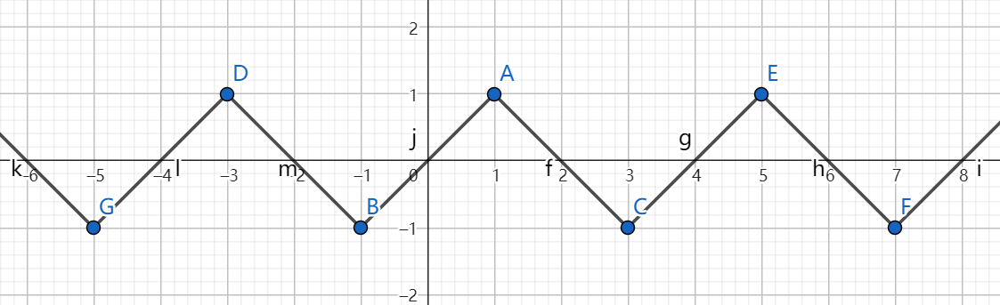

# 1. 变分形式

## 1.1 边值问题

欲求解**边值问题**([Boundary value problem](https://en.wikipedia.org/wiki/Boundary_value_problem))：

$$
\left\{
\begin{aligned}
	\mathcal{L}(u) &= 0, \quad x \in \Omega \\
	\mathcal{B_i}(u) &= 0, \quad i=1,2,\dots, n_B
\end{aligned}
\right.
$$

其中$\mathcal{L}(u)=0$为微分方程，例如$\mathcal{L}(u)=f+u''$；$\mathcal{B}_i(u)=0$为边界条件，例如$\mathcal{B}_i(u)=u(x_i)-g(x_i)$；$\Omega$为定义域；$u$为关于$x$的未知函数。

理想目标是找到满足边值问题的$u$。

## 1.2. 求解策略：试函数法

我们采取的求解策略是在**试空间(trial space)**$V$中找一个完全满足边界条件$\mathcal{B}_i(u)=0$、并尽可能满足微分方程$\mathcal{L}(u)=0$的近似解$u\in V$（被称为**试函数trial function**）。

例如试空间可能是$V=\{kx+b: k,b \in R\}$，
显然，能被该空间完全满足的微分方程并不多，
例如微分方程$u''=2$就永远不可能在$V=\{kx+b: k,b \in R\}$中找到解，因为$(kx+b)''\equiv 0$。

设边值问题的精确解为$u_e$，
我们的期望是近似解能尽可能地接近精确解，即它俩的差在某种模下尽可能小：$\min_{u\in V}||u_e-u||$。

但我们不知道精确解$u_e$的解析式，所以没法直接求$\argmin_{u\in V}||u_e-u||$。

## 1.3 Céa引理、变分形式与伽辽金法

[**Céa引理**](https://en.wikipedia.org/wiki/C%C3%A9a%27s_lemma)（见[2]的2.8.1）指出当一些有关$u$和边值问题的条件被满足时，有：

$$
||u_e-u|| \leq C\min_{v\in V} ||u_e-v|| , \quad C \text{ is constant}
$$

即近似解$u$关于$V$中的最优解呈线性关系。
因此我们的目标可以转为找到满足Céa引理条件的$u$。

Céa引理的条件比较复杂，我们一般也不会去验证，所以这里我们只挑选其中最重要的一条，它对我们计算近似解$u$有用：

$$
\begin{aligned}
R := &\mathcal{L}(u) \\
(R,v) &= 0 \quad \forall v \in V \\
\end{aligned}
$$

其中$(R,v) = \int_\Omega Rv dx$为函数内积（或称为$L^2$内积）。

也就是将近似解$u$代入微分方程$\mathcal{L}$后得到的 **残值$R$** 要与$V$中的任意函数$v$都内积为0（即$R$与$V$正交）。

通常称$(R,v)=0, \forall v \in V$为原边值问题的 **变分形式(variational formulation)** ，
并称通过求解该变分形式来获取原边值问题的近似解的方法为**伽辽金法(Garlekin Method)** 。

> 伽辽金法是一种**加权残值法(Weighted Residual Method)** 。
> 加权残值法也是求解变分形式来获取近似解，不过它的变分形式为：
> $$
> (R,v) = 0 \quad \forall v \in W
> $$
> 其中$W$为有别于试空间$V$的另一个空间，它被称为*test space*，而$v\in W$被称为*test function*。
> 伽辽金法就是当$W=V$时的加权残值法。

## 1.4. 强形式与弱形式

通过对$(R,v)$应用分部积分，有时可以降低对试函数$u$的可导性要求。
例如当$\mathcal{L}(u)=u'', \Omega=[0,1]$时：

$$
\begin{aligned}
(R, v) &= \int_\Omega u''vdx \\
&= \int_\Omega vdu' \\
&= \int_\Omega u'v'dx + u'v|^1_0 \\
\end{aligned}
$$

可以看到，原本$(R,v)$的计算要求$u$有二阶导数$u''$，但在经过一步分部积分后就只要一阶导数$u'$了。

一般地，我们将$(R,v)=0$经过分部积分后得到的形式称为**弱形式(weak formulation)** ，记为：

$$
F(u;v)=0 \quad \forall v \in V
$$

而原本那个有更高可导性要求的形式则称为 **强形式(strong formulation)** 。
强形式和弱形式都是变分形式，只是对试函数$u$的可导性要求不同而已。

特别地，实际问题中经常碰到满足双线性性质的$F(u;v)$，即满足如下性质的$F(u;v)$：

$$
\begin{aligned}
F(u+w;v) &= F(u;v) + F(w;v) \\
F(u;v+w) &= F(u;v) + F(u;w) \\
\end{aligned}
$$

称满足该性质的$F(u;v)$为双线性形式(bilinear form)，此时弱形式更常见的记法为：

$$
a(u,v) = L(v) \quad \forall v \in V
$$

其中$a(u,v)$为双线性形式，$L(v)$为线性形式，即满足$L(v+w)=L(v)+L(w)$。

## 1.5. 边界条件

至今我们都只关注在边值问题中的微分方程部分$\mathcal{L}(u)=0$，
而没有讨论边界条件$\mathcal{B}_i(u)=0$。

为了简化问题，这里我们只允许两类边界条件：

1. **狄利克雷边界条件(Dirichlet boundary condition)** ：$\mathcal{B}_i(u)=u(x_i)-g(x_i)$，$g$为某个已知函数。
2. **诺依曼边界条件(Neumann boundary condition)** ：$\mathcal{B}_i(u)=u'(x_i)-g(x_i)$，$g$为某个已知函数。

### 1.5.1. 狄利克雷条件

为了让近似解$u$完全满足狄利克雷边界条件，我们修改试空间，使$\forall v \in V: \mathcal{B}_i(v)=0$，
即让试空间$V$中的所有函数都满足狄利克雷边界条件，
那么近似解$u\in V$自然也就满足狄利克雷边界条件了。

不过要注意这一做法仅适用于齐次狄利克雷边界条件$\mathcal{B}_i(v) = v(x_i) = 0$，
而对非齐次的狄利克雷边界条件$\mathcal{B}_i(v)=v(x_i) = C \neq 0$ 如果也使用该方法的话，
就会导致$V$不可能是线性空间：

$$
\begin{aligned}
&\qquad v_1, v_2 \in V \\
&\Rightarrow v_1(x_i)=v_2(x_i)=C \\
&\Rightarrow v_1(x_i)-v_2(x_i) = 0 \neq C \\
&\Rightarrow v_1 - v_2 \notin V
\end{aligned}
$$

而$V$如果不是线性空间的话，也就没法在$V$中找到一组基$\{\psi_i\}$使得$\forall v \in V: v = \sum c_i \psi_i$。
这会给我们求解$(R,v)=0, \forall v \in V$时带来麻烦，
因为我们没法利用$(R,v)$的线性性质来把它转换为$(R, \psi_i)=0$了。

所以非齐次的狄利克雷边界条件处理起来是需要一些技巧的。
本文将跳过这部分，请参阅[1]的1.11节和第4章。

【TODO：[1]中的讨论缺乏理论支撑，而[2]中的理论分析则仅对齐次狄利克雷边界条件进行，我需要再去查阅一下对非齐次狄利克雷边界条件进行的理论分析】

### 1.5.2. 诺依曼边界条件

为了让近似解$u$满足诺依曼边界条件$\mathcal{B}_i(u)=u'(x_i)-g(x_i)=0$，我们需要使用弱形式。

还是沿用之前的例子，当$\mathcal{L}(u)=u'', \Omega=[0,1]$时，对$(R,v)$应用分部积分得到：

$$
\begin{aligned}
(R, v) &= \int_\Omega u'v'dx + u'v|^1_0 \\
\end{aligned}
$$

将变分形式$(R,v)=0, \forall v \in V$写为常见的弱形式：

$$
\begin{aligned}
	a(u,v) = L(v) \quad \forall v \in V \\
\end{aligned}
$$

$$
\text{where}\left\{
\begin{aligned}
	& a(u,v) = \int_\Omega u'v' dx \\
	& L(v) = u'(0)v(0) - u'(1)v(1) \\
\end{aligned}
\right.
$$

注意到$L(v)$中包含$u'(0)$和$u'(1)$，也就是包含了所有可能的诺依曼。
假设我们有诺依曼边界条件$u'(0)=0, u'(1)=1$，则可以联立得到方程组：

$$
\left\{
\begin{aligned}
	a(u,v) &= L(v) \quad \forall v \in V \\
	u'(0) &= 0 \\
	u'(1) &= 1 \\
\end{aligned}
\right.

$$

该方程组的解$u$一定同时满足弱形式和诺依曼边界条件。

（别忘了，Céa引理说明$u$满足弱形式时它一定是试空间里最接近精确解$u_e$的函数）

### 1.5.3. 别名

* 狄利克雷边值条件被显式地写进了试空间的条件中，因此通常被称为*essential boundary condition* 。
* 诺依曼边值条件在推导弱形式时被自然地联立进弱形式中，因此通常被称为*natural boundary condition* 。

### 1.6. 例子
这节给出伽辽金法求解边值问题的例子。

【TODO】加个例子

# 2. 使用有限元构造试空间

## 2.1. 动机
使用伽辽金法求解边值问题的步骤可以概述如下：

1. 构造合适的试空间$V$，使$v\in V$都满足狄利克雷边界条件
2. 写出变分形式$(R,v)=0, \forall v \in V$（与其等效的弱形式$a(u,v)=L(v)$）
3. 联立变分形式与诺依曼边界条件，得到一个方程组
4. 求解该方程组得到试函数$u$中的待定系数，得到近似解$u$

可以看出问题的关键是构造合适的$V$，它能:

* 满足狄利克雷边界条件
* 让第4步的方程组容易求解

使用有限元构造的试空间$V$就满足这两个需求。

## 2.2. 试函数：分段多项式

我们选择使用 **分段多项式(Piecewise Polynomial)** 来构造试函数（也就是每段都是多项式函数的分段函数），例如：

这是因为：

* 狄利克雷边界条件只会影响到靠近边界的那一段函数
* 通过选取合适的系数，多项式函数很容易满足狄利克雷边界条件（例如对于多项式$x+b$，只要使$b=-x_i$就能在$x=x_i$时归0）
* 分段多项式函数构成的试空间为线性空间，因此第4步得到的变分形式方程组为线性方程组，很容易求解

## 2.3. 剖分与单元

首先将定义域$\Omega$剖分，得到 **剖分(subdivision)** $\mathcal{T}$（剖分的定义见[2]的3.3.8，简单来说就是不相交的子集集合，其并集为整个$\Omega$）。
将剖分中的一个子集称为一个 **单元(element)** 。

设在任意单元$K \in \mathcal{T}$内试函数都是一个多项式函数$P_K$，称其为 **形函数(shape function)** ，整个定义域上的分段多项式$P$为：

$$
P|_K = P_K
$$

即$P$在$K$中等于$P_K$。

## 2.4. 多项式空间$\mathcal{P}_m$与基函数

接下来我们定义单元内的多项式函数$P_K$。

为了方便，记$\mathcal{P}_m$为由最高次数小于等于$m$的多项式构成的函数空间。

我们的目标是在多项式函数空间$\mathcal{P}_m$里找到一组合适的基$\{\phi_i\}$：即存在常系数$\{c_i\}$使得$P_K=\sum c_i \phi_i$。

任何基都是合法的，例如当$x\in R^1$，对于函数空间$\mathcal{P}_1$，基$\{\phi_1=x, \phi_2=1\}$是合法的，我们可以设$P_K = c_1x + c_2$，然后用$P_K$构造$\Omega$上的分段多项式函数$P$，再把$P$作为试函数代入变分形式$(R,v)=0, \forall v \in V$中进行求解，最终得到$c_1, c_2$。

我们选取的基函数为有限元基函数。

## 2.5. 有限元基函数：拉格朗日线性三角元

**有限元基函数** 的形式化定义方法和其他常见的构造方法(e.g. Hermite Element, Argyris Element)参见[2]的第3章和[3]的第9章，本文将只介绍 **拉格朗日线性三角元(Lagrange Linear Triangular Element)** 。

首先先解释一下“拉格朗日线性三角元”的含义：

* 三角元：意味着单元空间$K$是一个二维平面上的三角形。
* 线性：意味着构造的多项式函数$P_K$为一次函数，即$P_K \in \mathcal{P}_1$。
* 拉格朗日：意味着我们只使用顶点值来构造基函数，而不使用顶点上的导数值。与之相对的是Hermite使用顶点的一阶导数，Argyris使用顶点的二阶导数。（名字来源是拉格朗日插值多项式）

设$K$的三个顶点分别为$A, B, C$，其空间坐标为$\mathbf{x}_1, \mathbf{x}_2, \mathbf{x}_3$，有$\mathbf{x}_i \in R^2$。

有限元基函数$\phi_i$应当满足：

$$
\phi_i(\mathbf{x}_j) = 
\left\{
\begin{aligned}
	&1 \quad \text{if } i=j \\
	&0 \quad \text{if } i\neq j
\end{aligned}
\right.
$$

即有限元基函数$\phi_i$仅在$\mathbf{x}_i$上取值为1，而在其他顶点上都取值为0。
该式也被记为$\phi_i(\mathbf{x}_j)=\delta_{ij}$，其中$\delta_{ij}$为 **克罗内克函数(Kronecker delta)** 。

利用有限元基函数的这一要求和$\phi_i \in \mathcal{P}_1$的条件，我们可以求出$\phi_i$——

以$\phi_1$为例。
由$\phi_1 \in \mathcal{P}_1$可设$\phi_1(\mathbf{x}) = (k_1, k_2) \cdot \mathbf{x} + k_3$，
而因为$\phi_1$仅在$\mathbf{x}_1$上取值为1，而在$\phi_2, \phi_3$上都取值为0，所以可得方程组：

$$
\left\{
\begin{aligned}
	(k_1, k_2) \cdot \mathbf{x}_1 + k_3 = 1 \\
	(k_1, k_2) \cdot \mathbf{x}_2 + k_3 = 0 \\
	(k_1, k_2) \cdot \mathbf{x}_3 + k_3 = 0 \\
\end{aligned}
\right.
$$

它是一个关于$k_1, k_2, k_3$的线性方程组，只要$\mathbf{x}_1, \mathbf{x}_2, \mathbf{x}_3$不共线就一定有唯一解或无解。解得：

$$
M := x_1y_2-x_3y_2-x_1y_3-x_2y_1+x_3y_1+x_2y_3
$$

$$
\left\{
\begin{aligned}
	k_1 &= \frac{y_2-y_3}{M} \\
	k_2 &= \frac{x_1-x_2}{M} \\
	k_3 &= \frac{x_3y_3-x_3y_2+x_2y_3-x_1y_3}{M} \\
\end{aligned}
\right.
$$

其中$x_i, y_i$为$\mathbf{x}_i$的分量，即$\mathbf{x}_i=(x_i, y_i)$。

同理可求得$\phi_2, \phi_3$。

此处略去证明$\{\phi_1, \phi_2, \phi_3\}$为$\mathcal{P}_1$的一组基的过程。
（提示：因为二维情况下$dim\mathcal{P}_1=3$，所以只要证明$\phi_1, \phi_2, \phi_3$线性无关即可。）

## 2.6. 狄利克雷边界条件

下面讨论在使用有限元基函数时该怎么让试函数满足狄利克雷边界条件。

首先要假设所有狄利克雷边界点都在三角元的顶点上。
尽管落在其他位置的情况也可以处理，但那就超出拉格朗日线性元可以方便处理的范畴了，因此此处为了简化讨论还是假设边界点都在顶点上。

设在单元$K$中三个顶点的空间坐标分别为$\mathbf{x}_1, \mathbf{x}_2, \mathbf{x}_3$，有(齐次)狄利克雷边界条件为$u(\mathbf{x}_1)=0$。

设该单元内的基函数为$\{\phi_i\}$，且该单元内的多项式函数$P_K=\sum c_i \phi_i$，则有：

$$
\begin{aligned}
	u(\mathbf{x}_1) 
	= P|_K(\mathbf{x}_1) 
	= P_K(\mathbf{x}_1)
	= \sum c_i \phi_i(\mathbf{x}_1)
	= c_1
\end{aligned}
$$

其中最后一步是因为$\phi_i(\mathbf{x}_j)=\delta_{ij}$。

由$u(\mathbf{x}_1)=c_1$可知，
要让$v\in V$满足$u(\mathbf{x}_1)=0$的边界条件，
就是要让$c_1=0$。
而$c_1$是我们想要求解的一个未知系数。

所以可以不用显式地对试空间$V$做任何处理，只要在最后把狄利克雷边界条件$\mathcal{B}_i=u(\mathbf{x}_i)=c_i=0$也联立进变分形式的方程组中即可：

$$
\left\{
\begin{aligned}
& a(u,v) = L(v) \quad \forall v \in V \\
& c_i=0
\end{aligned}
\right.
$$

实际计算时就是用$c_i=0$消去线性方程组中的若干行，非常容易。

【TODO：在使用有限元基函数时，非齐次狄利克雷边界条件会不会也变得容易处理了？】

## 2.7. 连续性与误差估计

使用拉格朗日元构造的试空间在连续性和与精确解之间的误差上有以下性质：

1. 连续性（见[2]的3.3.17）：试函数$P$至少一阶可导，但导函数不一定连续，即$P \in C^0$。
	* 连续性确保了试函数$u$总是一阶可导，所以在求解二阶微分方程时能代入弱形式$a(u,v)=L(v), \forall v \in V$进行计算。 
2. 误差估计（见[2]的4.4.28和5.4.8）：求解变分形式$(R,v)=0, \forall v \in V$后得到的近似解$u$与边值问题的精确解$u_e$之间的差值满足：
	* $||u_e-u||_{L^2(\Omega)} \leq C h^{m+1} ||u_e||_{H^{m+1}(\Omega)}$
	* 其中$C$为与剖分形状相关的常系数，$h\in (0,1]$为单元直径关于定义域直径的比例，$m$为基函数的最高次数（即$\mathcal{P}_m$的$m$），$\Omega$为定义域，$H^{m+1}=W^{m+1}_2$为索博列夫空间（不知道索博列夫空间是什么也没影响）。
	* 可以理解为近似解$u$的误差关于$h^{m+1}$呈线性关系：
		* 剖分得越细，$h$就越小，误差也就越小
		* 使用越高次的多项式作基函数，$h^{m+1}$就越小，误差也就越小

## 2.8. 例子
本节给出使用有限元基函数构造试函数，然后使用伽辽金法计算边值问题近似解的例子。

【TODO】加个例子

# 参考文献
1. Stationary variational forms. http://hplgit.github.io/num-methods-for-PDEs/doc/pub/index.html.
2. Brenner, S. C. & Scott, L. R. The mathematical theory of finite element methods. (Springer, 2008).
3. Approximation of functions. http://hplgit.github.io/num-methods-for-PDEs/doc/pub/index.html.

