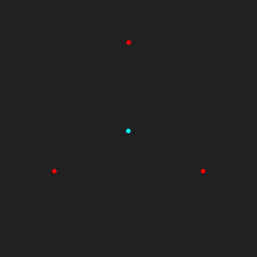
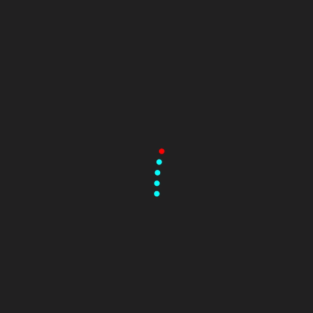

#! https://zhuanlan.zhihu.com/p/339879519

# 论文阅读：Position Based Dynamics

本文为对[Position Based Dynamics](https://doi.org/10.1016/j.jvcir.2007.01.005)的论文阅读。本文并不会涵盖论文的所有内容，同时也会做相当多的补充，因此内容上会有很大的差异，但所介绍、使用的方法都是原论文中的内容。

下文中略称Position Based Dynamics为PBD。

# 一、PBD的含义与出发点
Position based是相对于传统的force based而言的。一般进行物理模拟时，都是对t时刻的物体进行受力分析，然后根据牛顿第二定律$F=am$求出t时刻的加速度a，再根据加速度a进行时间积分，由当前时刻的系统状态（速度、位移）求出下一时刻的系统状态：

$$
    \begin{aligned}
    v' &= v+\int_t^{t+\Delta t}adt \\
    x' &= x+\int_t^{t+\Delta t}vdt
    \end{aligned}
$$

因为a通常是根据时间发生变化的，所以积分$\int_t^{t+\Delta t}adt$并不好求，一般都只能得到在时间区间$[t, t+\Delta t]$中的几个点上的a，所以通常都是看成常微分方程，然后使用一些数值方法来计算。

$v'=v+\int_t^{t+\Delta t}adt$其实是根据$\frac{dv}{dt} = a$得到的，这也就是个常微分方程。例如用欧拉法求解的话就是$v_{n+1}=v_n+\Delta ta_{n}$，本质就是把上面的那个积分近似成$\int_t^{t+\Delta t}adt \approx a|_t\Delta t$

Force based方法因为不直接操纵位移，所以很容易出现overshooting问题。
* overshooting问题：就是数值不稳定(numerical instability)问题。受限于计算机字长限制（一个float能表示多少位有效数字），每一步计算都会舍去一些微小的数值，导致误差，这被称为舍入误差。如果在第n步引入的舍入误差$e_n$能在第m步，$m>n$，的时候趋近于0，也就是随着迭代，前面步骤的舍入误差的影响越来越小、趋近于0的话，那这一数值算法就是数值稳定的。

通常来说，时间步长$\Delta t$越小，方法越数值稳定，也就越不容易出现overshooting问题。但是$\Delta t$越小，为了经过相同的时间跨度所需要的迭代次数就越多，计算量也就越大。$\Delta t$缩小10倍，那迭代次数就得增大10倍。

所以在步长不能足够小时，通常使用隐式方法来避免overshooting问题，因为隐式方法相对而言比较容易数值稳定。不过隐式方法的计算量通常都大得多，所以force based方法的overshooting问题并不是完全解决的，通常都需要在数值稳定性和计算复杂度之间做个取舍，以求用尽量快的速度获得尽量好的效果。

Position based方法则是抛掉加速度，而直接处理位移x。很多力都可以表示为当前系统中质点位移的函数（例如保守力），例如磁铁的排斥力、弹簧的拉力。
* Force based方法处理这些力的时候，就是先由位移得到一个势能函数$E_p$，然后对势能函数求导（$F=-\nabla E_p$），就得到了力$F$，然后再按照上面的流程计算加速度、速度、位移。也就是“位移=>力=>加速度=>速度=>位移”这样一个流程。
* Position based方法则直接根据描述力的那个以质点位移为输入的函数，得到一个对质点位移的约束函数。例如两个由一根棒子相连的小球，它们之间的约束可以描述为$C(x_1, x_2)=||x_2-x_1||-l=0$，其中$l$为棒子的长度。然后直接修改当前位移，使其满足这些约束函数。也就是跳过了“位移=>力=>加速度=>速度=>位移变化量”的中间阶段，而直接“位移=>位移变化量”。
    * 附带一提，“直接修改当前位移，使其满足约束函数”这一过程在论文中被称为“约束投影”(constraint projection)。

PBD的优势在于：
* 不会因为时间步长过大而出现上面的overshooting问题，因为不管时间步长多大，每一步都会直接投影回来，不会出现“爆炸”的情况。
    * 注：不过这并不意味着真正的数值稳定，因为真正的数值稳定要求的是当前时间步的误差会随着迭代的进行趋于0，而PBD并不保证误差会趋于0，它仅仅只是保证下一步的系统状态的误差在一个较小的范围内。另一方面，也要注意哪怕约束投影成功把所有约束都满足了，但将约束力抽象成由约束函数决定的位移变化量这一近似带来的截断误差也是不会被消除的。也就是说，哪怕约束投影得到的位移满足所有约束，此时的系统状态也不一定就是正确的，因为“约束”本身就是现实力的一个近似。
* 可以很方便地直接操控顶点位置。
    * 直接操控顶点位置这一需求在游戏中很常见，因为PBD本来就是每次迭代都直接修改顶点位置，所以介入这一过程会比force based方法要方便得多。

# 二、算法
Position Based Dynamics在每个时间步的位移更新大致可以分成两步：
1. 没化成位移约束的力的作用
    * 像重力啥的，虽然本质上是个保守力，与位移相关，应该是可以化为位移约束的。例如考虑四颗小球，三颗在外围，一颗在中央。忽略外围三颗小球互相的万有引力，只考虑它们对中央小球的引力，如果三颗小球质量相等的话，在一个小的范围内，可以看成位移约束：中央的小球到外围三颗小球的距离都为0。（中央小球和每个外围小球构成的三个系统各自的稳定点，也就是势能最低点，就是各自距离为0的时候）
    
    * 但是，在实际模拟时，这类约束并不健壮，最终的系统状态很大概率就是中央的小球到每个小球的距离都不为0，也就是每个约束都不满足。（在附录处，我把模拟这四个球的taichi代码贴了上来，很简单的一个模拟，结果是很明显的，几乎没有任何一个时刻会满足约束）
    * 所以，通常把重力这些不适合化为位移约束的力直接作为力对待，使用force based方法来计算这些力作用下系统下一时刻的状态。
2. 约束投影(constraint projection)
    * 用一些方法，直接调整位移，使其满足约束。

可以想象成把力分为了两个批次，先后对物体产生作用。显然因为现实中力的作用是同时的，所以这种近似必定会带来一定的误差。具体这个误差是多少，我暂时没想明白咋算。
* 第一个批次依然是force based的方法：进行受力分析，计算合力、加速度、时间积分，得到速度变化量、位移变化量。
* 第二个批次则是position based的方法，直接根据约束计算位移变化量，使变化后的位移满足约束。

第一个批次的计算在此不做讨论，原论文中也仅仅只是使用显式欧拉法$v_{n+1}=v_{n}+\Delta t a_n$来简单得到的。

第二个批次的关键点在于如何计算位移变化量，本节剩下的篇幅都将讨论这一问题。


## 1. 约束投影

### (1). 形式化定义
目标是计算位移变化量$\Delta x$，使得$x+\Delta x$对每个约束都成立。

首先要做的是将约束形式化定义。原论文中将其分为两类：
* equality：形如$C(x_1, x_2, ..., x_n)=0$的约束。
    * 例如，由一根棒子相连的两个小球，它们的位移约束是$C(x_1, x_2)=||x_1-x_2||-l=0$，是equality约束。
* inequality：形如$C(x_1, x_2, ..., x_n)\geq 0$的约束。
    * 例如，二维平面上描述一个点不能到x轴负半平面，也就是它被y轴挡住了，不能穿过去。可以用约束$C(x)=x\cdot [1\ 0]^T \geq 0$来表示，其中$\cdot$表示点积。

原论文中处理inequality约束的方法是首先检查当前是否已经满足该约束，如果满足的话那就跳过，否则将其转换成equality约束进行处理（也就是不等号变等号）。

如此处理inequality约束后，就只剩下equality约束了，而每个equality约束实际上就是一个关于$\Delta x$的方程，所有的equality约束就构成一个关于$\Delta x$的方程组。想要得到$\Delta x$满足所有约束，就是要求解这个方程组。

形式化定义一下。设有$n$个质点，第i个质点的原位移为$x_i$，并设$x=[x_1, x_2, ..., x_n]^T$。设有m个约束函数（包括由inequality约束转换得到的），第j个约束函数为$C_j(x)$。所要求的就是某个$\Delta x = [\Delta x_1 \ \Delta x_2 \ ... \ \Delta x_n]^T$，使得对$j=1,2,...,m$，都有$C_j(x+\Delta x)=0$。也就是求解如下关于$\Delta x$的方程组：

$$
\left\{\begin{aligned}
    C_1(x+\Delta x) &= 0 \\
    C_2(x+\Delta x) &= 0 \\
    ... \\
    C_m(x+\Delta x) &= 0 \\
\end{aligned}\right.
$$

### (2). 方程组性质分析

$C_j(x)$通常都是一个非线性函数，例如就连最简单的距离约束函数$C(x_1, x_2)=||x_1-x_2||-l$都是非线性的，所以该方程组通常也都是非线性的。

而另一方面，如果假设在三维空间的话，要求$\Delta x$就意味着有$3n$个变量要求，而方程数量$m$并不一定等于$3n$，这就意味着该方程组在一般情况下要么欠定($m<3n$，解不唯一)，要么过定($m>3n$，很可能无解)。

### (3). n元方程组化为m个一元方程

原文中为了求解这一方程组，使用了他称之为“Gauss-Seidel-type iteration”的方法，我并没有找到该词的出处，推测是作者自己造的。这个词的含义是引用了求解线性方程组的Gauss-Seidel方法的不可并行性。求解线性方程组的Gauss-Seidel方法因为迭代计算时第$n+1$个变量的迭代需要在第$n$个变量迭代完才能进行，所以每次迭代都只能串行地逐个迭代每个变量，而不能并行地同时迭代所有变量。“Gauss-Seidel-type”指的就是每次迭代都串行计算的概念。
* 然后，除此之外就没有任何关联了，不用想了。

这里它的串行是“逐个约束”的串行，也就是按照$C_1=0, C_2=0, ..., C_m=0$的顺序，逐个求解$\Delta x$。每个约束处理完，就根据求解的$\Delta x$更新$x$，然后再处理下一个约束。显然这一方法的话，只逐个处理一次很容易会处理完最后一个以后破坏第一个约束，所以作者将这一过程迭代多次。

这里存在的一个问题是，求解每个约束$C_j(x+\Delta x)=0$时，因为有$3n$个变量，而方程仅仅只有一个，所以有无穷多解。需要增加另外的约束才能求解。

我是觉得这个方程组的求解比较像最优化问题。在欠定的情况下，找到一个尽可能好的解（使某个奖励函数的值尽可能大）。在过定的情况下，找到一个尽可能不差的解（使某个惩罚函数的值尽可能小）。而这个最优化的目标就构成了上面提到的“另外的约束”。

不过原文没有使用最优化的思路，而是直接指定了$\Delta x$的方向，这样对每个约束计算$\Delta x$的时候仅仅只需要求$\Delta x$的大小，这一个变量，就行了。

$\Delta x$的方向，原文是基于“动量、角动量守恒”这一出发点指定的。“动量、角动量守恒”是指系统在质点们的位移为$x$时具有的动量、角动量，应与位移为$x+\Delta x$时具有的相同。为什么应该相同呢？
* 这首先要考察“系统”在这里指的是什么。很容易发现，“系统”在这里指的就是所有质点的集合，那问题是“所有质点”涵盖了哪些对象？举个例子，显然地球的质心不在这个范围内，虽然我们考虑了重力。
    * 另一方面，重力也并不在“第二个批次”内，也就是我们并没有用位移约束来描述重力，所以地球质心也就不在这个“系统内”。
    * 这就导出了结论，“系统”是位移约束的对象的集合。
* 因为“系统”是位移约束的对象的集合，所以由位移约束描述的作用力都是这个系统的内力（如果一个力的作用对象都在系统内的话，那它就是内力）。
* 而根据动量守恒定理、角动量守恒定理，一个系统的内力是不会改变这个系统整体所具有的动量和角动量的。
* 综上，因为$\Delta x$是根据位移约束得到的，是“内力”的作用结果，所以系统在质点位移为$x$时的动量与角动量应该与在$x+\Delta x$时相同。

接下来的问题是如何找到这样一个不改变动量、角动量的方向？注意这里$\Delta x$的方向指的并非单纯的质点的“位移方向”，还包括了不同质点之间的位移距离的比例。事实上，如果假设所有质点的质量都为1的话，整个系统的质心位移就是$x_c=\frac{1}{n}\sum_{i=1}^n x_i$，位移变化量就是$\Delta x_c = \frac{1}{n}\sum_{i=1}^n \Delta x_i$，也就是$\Delta x$的所有分量之和除以n。显然，$\Delta x$描述了系统质心位移的变化量$\Delta x_c$。

原文的思路其实就是找一个方向，在这个方向上的$\Delta x$都会使$\Delta x_c=0$，也就是系统质心位移不变，那么动量与角动量当然也不变（速度可以看成是当前时刻位移与上一时刻位移的差值除以时间步长，所以当前时刻位移不变的话，速度当然也不变）。

问题就变成怎么找一个方向使系统质心位移不变。

这里得回过头去看一下约束函数$C_j(x)$，不难发现，当这一约束函数描述的力产生作用时，其函数值会发生改变。例如，距离约束$C(x_1, x_2)=||x_1-x_2||-l$描述的是棒子的弹力，当棒子把两个小球拉近/弹远一点的时候，函数值就变小了点。

所以约束函数$C_j(x)$的值的变化可以看成是内力的作用。而内力的作用是不会改变系统质心位移的，设$\Delta C_j(x) = C_j(x+\Delta x)-C_j(x)$，若物体只做刚体运动（平移、旋转）（此时$\Delta C_j(x)$一定是内力作用的结果），则有如下命题成立：
    
$$
    \Delta C_j(x)\neq 0 \Rightarrow \Delta x_c=0
$$

所以问题就变成了怎么找一个方向使得约束函数$C_j(x)$的值一定随$x$的改变发生改变。这个问题很简单，沿梯度方向$\nabla C_j = \frac{\partial C_j}{\partial x}$基本是肯定会改变函数值的。原论文就采用了这一方向。

结果就是，取$x$处的$\nabla C_j$作为$\Delta x$的方向，即设$\Delta x = \lambda \nabla C_j(x)$，其中$\lambda \in R$。

### (4). 具体求解
回过头去看一下想要求解的方程组：

$$
\left\{\begin{aligned}
    C_1(x+\Delta x) &= 0 \\
    C_2(x+\Delta x) &= 0 \\
    ... \\
    C_m(x+\Delta x) &= 0 \\
\end{aligned}\right.
$$

根据(3)部分的论述，求解的思路就是对每个约束$C(x+\Delta x)=0$，使$\Delta x=\lambda \nabla C(x)$，则得到$m$个关于$\lambda$的一元方程$C(x+\lambda \nabla C(x))=0$。

使$x_0$表示进行约束投影前的质点位移，设$x_j=x_{j-1}+\lambda_j \nabla C_j(x_{j-1})$，其中$\lambda_j$为关于$\lambda_j$的一元方程$C_j(x_{j-1}+\lambda_j \nabla C_j(x_{j-1}))=0$的解。则$x_m$就是经过一次约束投影后得到的质点位移。至此，就得到了一个完整的约束投影的算法，逐个求解$x_j$即可。

不过一元方程$C(x+\lambda \nabla C(x))=0$通常是个非线性方程，挺难求解的。原文中为了降低计算量，用泰勒展开进行了线性化的近似处理：

$$
    C(x+\lambda \nabla C(x))
    \approx 
    C(x)+\lambda\nabla C(x) \cdot \nabla C(x)
    = 0
$$

解出$\lambda$：

$$
    \lambda = - \frac{C(x)}{||\nabla C(x)||^2}
$$

则对应的$\Delta x$就是：

$$
    \Delta x = - \frac{C(x)}{||\nabla C(x)||^2} \nabla C(x)
$$


### (5). 关于质量
注意到上面我们在确保系统质心位移不变时，曾假定所有质点的质量都为1，当时是为了方便后面叙述，下面考虑质点质量不同的情况。设质点$i$的质量为$m_i$，并为了方便而设$w_i=\frac{1}{m_i}$。为了方便叙述，设$\Delta x$为质点质量都为1的时候求出来的位移变化量，而$\Delta x'$为质点质量不相同的时候求出来的位移变化量。由前述(1)~(4)的方法我们可以求出$\Delta x$，现在想要求$\Delta x'$。

$\Delta x'$也依然需要满足
1. $C(x+\Delta x')=0$
2. $\Delta x_c' = \frac{1}{\sum m_i}\sum_{i=1}^n m_i \Delta x_i' = 0$

为了满足条件2，使系统质心位移不变，假设$\Delta x_i' = kw_i\Delta x_i$，其中k为待定系数，则$\Delta x_c' = \frac{1}{\sum m_i}\sum_{i=1}^n m_i k w_i \Delta x_i = \frac{k}{\sum m_i}\sum_{i=1}^n \Delta x_i$，因为$\Delta x$是质量都为1时候求出来的位移变化量，所以$\sum_{i=1}^n x_i=0$，故$\Delta x_c'=0$。

然后为了满足条件1，将其线性化，得到：

$$
\begin{aligned}
    C(x+\Delta x')
        &\approx C(x)+\Delta x' \cdot \nabla C(x) \\
        &= C(x) + k\sum_{i=1}^nw_i\Delta x_i \cdot \nabla_{x_i}C(x)
\end{aligned}
$$

而因为$C(x+\Delta x)=0$，所以将其线性化后可以得到：

$$
\begin{aligned}
    C(x+\Delta x) \approx& C(x) + \Delta x \cdot \nabla C(x) = 0 \\
    \Rightarrow & C(x) = - \sum_{i=1}^n \Delta x_i \cdot \nabla_{x_i}C(x)
\end{aligned}
$$

将上两式代入$C(x+\Delta x')=0$得到：

$$
\begin{aligned}
    C(x+\Delta x')
        &= - \sum_{i=1}^n \Delta x_i \cdot \nabla_{x_i}C(x) + k\sum_{i=1}^nw_i\Delta x_i \cdot \nabla_{x_i}C(x) = 0 \\
        &\Rightarrow k = \frac{\sum_{i=1}^n \Delta x_i \cdot \nabla_{x_i}C(x)}{\sum_{i=1}^nw_i\Delta x_i \cdot \nabla_{x_i}C(x)}
\end{aligned}
$$

注意到$\Delta x_i \cdot \nabla_{x_i}C(x) = -\frac{C(x)}{||\nabla C(x)||^2} || \nabla_{x_i} C(x) ||^2$

则有：

$$
        k = \frac{\sum_{i=1}^n ||\nabla_{x_i}C(x)||^2}{\sum_{i=1}^nw_i||\nabla_{x_i}C(x)||^2}
$$

**接下来只是推测。**

我推测应该存在某个条件能够估计出$||\nabla_{x_i}C(x)||^2 \approx 1$，因为代入$C(x_1, x_2) = ||x_1-x_2|| - l$，得到$\nabla C = [\frac{x_1-x_2}{||x_1-x_2||}\ \frac{x_2-x_1}{||x_1-x_2||}]^T$，显然满足$||\nabla_{x_i}C(x)||^2 = 1$。

假设$||\nabla_{x_i}C(x)||^2 = 1$，就能得到：

$$
    k = \frac{n}{\sum_{i=1}^n w_i}
$$

由此得到最终的位移变化量：

$$
\begin{aligned}
    \Delta x'_i &= \frac{n w_i}{\sum_{j=1}^n w_j} \Delta x_i  \\
    &= - \frac{n w_i}{\sum_{j=1}^n w_j} \frac{C(x)}{||\nabla C(x)||^2} \nabla_{x_i} C(x)
\end{aligned}
$$


# 三、刚度系数、碰撞检测、阻尼
TODO 讲讲这些和算法核心无关的内容

呃，这章大概不写了，感觉我也写不出来啥和原论文有差别的地方，我也解读不出来更多东西。


# 四、Demo
原文里是拿个布料模拟来做demo，那个太NB了，我自己写的简单很多很多。



模拟的东西很简单，就是五个质点$x_0, x_1, x_2, x_3, x_4$，相邻两个之间有长度约束$||x_{i+1}-x_{i}=l||$。

先忽略$x_0, x_1$之间的长度约束，它俩比较特别。

用PBD的思路做的话，就是有这么一组约束函数：$C_i(x)=||x_{i+1}-x_i||-l\quad i=1,2,3$。

第k次迭代按照如下步骤：
1. 更新加速度：因为非约束力的外力只有重力，而重力带来的加速度固定是重力加速度$g$，所以每个质点的加速度都是$a^k=g$。
2. 预计算速度：根据加速度预计算只考虑了非约束力外力的速度$v'^k=v^{k-1}+a^k\Delta t$。
3. 预计算位移：根据速度预计算只考虑非约束力外力的位移$x'^k=x^{k-1}+\frac{(v^{k-1}+v'^k)\Delta t}{2}$。
    * 这里用梯形公式计算，只是我一时兴起而已，并没有特别的含义。
4. 投影约束：迭代若干轮（我迭代了两轮），对每个约束计算其对应的位移修正量。设每个约束函数修正前为$x$，修正量为$\Delta x$，约束为$C_j(x)=||x_{j+1}-x_j||-l=0$。由前文一堆论述可知：
    * $\Delta x_i \approx - \frac{n w_i}{\sum_{j=1}^n w_j} \frac{C(x)}{||\nabla C(x)||^2} \nabla_{x_i} C(x)$
    * 因为质点质量相等，且$\nabla C_j(x) = [0\ 0\ ... \frac{x_j-x_{j+1}}{||x_{j+1}-x_j||} \ \frac{x_{j+1}-x_j}{||x_{j+1}-x_{j+1}||} \ 0 ... 0]$，其中非零项为第j项和第j+1项。
    * 所以$\Delta x \approx [0\ 0\ ...  \frac{1}{2}(\frac{l}{||x_{j+1}-x_j||}-1)(x_j-x_{j+1}) \quad  \frac{1}{2}(\frac{l}{||x_{j+1}-x_j||}-1)(x_{j+1}-x_j) \quad  0 ... 0]$，其中非零项为第j项和第j+1项。
    * 最后经过（迭代轮数$\times$约数个数）次迭代后的$x$就是$x^k$，即第k时刻的质点位移。
5. 更新速度：计算$v^k = \frac{2}{\Delta t}(x^k-x^{k-1})-v^{k-1}$，
    * 还是用梯形公式进行计算，依然没有特别的含义。

最后提一下关于$x_0$的处理，在原论文里这块就叫attachment，因为质点0是直接被我提着跑的，它不参与物理计算。所以$x_0$在每次迭代的时候都是被指定的，而非被物理计算出来的。因此包含$x_0$的约束$C_0(x)=||x_1-x_0||-l=0$导出的$\Delta x$虽然包含对$x_0$的更新，但却会被无效化。所以我们希望投影约束过程中能自动地让$\Delta x_0$为0。为了实现这一目的，原论文中是将质点0的质量设为无限大，也就是使质量的倒数$w_0=0$。这确实是很好的策略。我自己耍着玩，用了另一种策略。

我在处理约束$C_0$时，不使用$\nabla C_0$作为$\Delta x$的方向，而是直接指定$[0 \ \frac{x_1-x_0}{||x_1-x_0||} \ 0 ... 0]$为其方向。因为$\Delta x$关于这个方向是线性关系，所以$\Delta x_0$就等于0了。这么做的话$\Delta x$不会保证动量守恒，不过其实假设质点0质量无穷大的时候，由质点0和质点1构成的这个系统的动量也已经无穷大了，所以这块儿守不守恒我感觉问题不大。就结果来看也确实没啥问题。

最后taichi的代码附在附录二中。


# 附录一、四球模拟
```python
import taichi as ti
from random import random
from tqdm import tqdm
from math import sin, pi, sqrt

################
# Support Functions
################

################
# Init taichi
################
ti.init(arch=ti.gpu)

################
# Input data
################
x1 = [-sqrt(3)/2, -1/2]
x2 = [sqrt(3)/2, -1/2]
x3 = [0, 1]
x = [0, 0]
v = [random()*2-1, random()*2-1]
gravityConstant = 0.5
timestep = 0.01


################
# Taichi Tensors
################


################
# Kernels
################


################
# Time Loop Functions
################
def calGravity(x, y):
    # From x to y
    d = [y[0]-x[0], y[1]-x[1]]
    k = d[0]*d[0] + d[1]*d[1]
    k = pow(k, 1.5)
    k = gravityConstant / k
    return [k*d[0], k*d[1]]

def TimeTick(t):
    a_list = [
        calGravity(x, x1),
        calGravity(x, x2),
        calGravity(x, x3),
    ]
    a = [0, 0]
    for sa in a_list:
        a[0] += sa[0]
        a[1] += sa[1]
    
    # update
    x[0] += timestep * v[0]
    x[1] += timestep * v[1]
    v[0] += timestep * a[0]
    v[1] += timestep * a[1]

################
# Init tensors
################


################
# GUI Settings
################
videoManager = ti.VideoManager(output_dir="./video", framerate=24, automatic_build=False)
gui = ti.GUI(background_color=0x222222)
colors = [0xFF0000, 0x00FFFF, 0x0000FF, 0xFFFF00, 0xFF00FF, 0x00FF00]
def world2screen(x, y):
    L = 1.5
    x = (x-(-L))/(2*L)
    y = (y-(-L))/(2*L)
    return (x,y)

show_on_screen = True

seconds = 5
fps = 24
if show_on_screen:
    fps = 60
timestepsPerFrame = int(1.0/fps/timestep)
totalFrame = seconds*fps
if show_on_screen:
    totalFrame = 1000000


################
# Main Loop
################
print("v0: ", v)
for frameCount in tqdm(range(totalFrame)):
    print(x)
    for t in range(timestepsPerFrame):
        TimeTick(timestep*t + frameCount/fps)

    gui.circle(world2screen(x1[0],x1[1]), color=colors[0], radius=5)
    gui.circle(world2screen(x2[0],x2[1]), color=colors[0], radius=5)
    gui.circle(world2screen(x3[0],x3[1]), color=colors[0], radius=5)
    gui.circle(world2screen(x[0],x[1]), color=colors[1], radius=5)

    if show_on_screen:
        gui.show()
    else:
        img = gui.get_image()
        videoManager.write_frame(img)
        gui.clear()
if not show_on_screen:
    videoManager.make_video(gif=True, mp4=False)

```


# 附录二、简单的PBD demo
``` python
import taichi as ti
from random import random
from tqdm import tqdm
from math import sin, pi, sqrt

################
# Support Functions
################
def assignArray2Tensor(t, i, a):
    for j in range(len(a)):
        t[i][j] = a[j]

def diffDotProd(a, b):
    res = 0
    for i in range(3):
        res += (a[i]-b[i]) * (a[i]-b[i])
    return sqrt(res)

################
# Init taichi
################
ti.init(arch=ti.gpu)

################
# Input data
################
def Calx0(t):
    loopInt = 4 # s # 2s for a loop
    x = sin(t/loopInt*2*pi)
    y = sin(t/loopInt*2*pi)
    return [x, y, 0]
n = 5
lConst = 0.1
xInitRel = [[0, -lConst*i, 0] for i in range(5)]
gravityConstant = 9.8
timestep = 0.01


################
# Taichi Tensors
################
x = ti.Vector(3, dt=ti.f32, shape=(n))
v = ti.Vector(3, dt=ti.f32, shape=(n))
vPer = ti.Vector(3, dt=ti.f32, shape=(n))
xPer = ti.Vector(3, dt=ti.f32, shape=(n))
a = ti.Vector(3, dt=ti.f32, shape=(n))
l = ti.field(ti.f32, shape=(n))


################
# Kernels
################
@ti.kernel
def CalvPer():
    for i in v:
        vPer[i] = v[i] + a[i] * timestep

@ti.kernel
def CalxPer_rest():
    for i in x:
        xPer[i] = x[i] + timestep/2 * (v[i] + vPer[i])

@ti.kernel
def Updatev():
    for i in v:
        v[i] = 2/timestep * (xPer[i]-x[i]) - v[i]
    
@ti.kernel
def Updatex():
    for i in x:
        x[i] = xPer[i]


################
# Time Loop Functions
################
def CalxPer(t):
    CalxPer_rest()
    xPer[0] = Calx0(t)

def CalPer(t):
    CalvPer()
    CalxPer(t)

def SolveConstraints():
    ITER_NUM = 2
    for i in range(ITER_NUM):
        # C0
        k = l[0]/diffDotProd(xPer[1], xPer[0])-1
        for u in range(3):
            xPer[1][u] += k * (xPer[1][u]-xPer[0][u])
        # Cj
        for j in range(1, n-1):
            k = 0.5 * (l[j]/diffDotProd(xPer[j+1], xPer[j])-1)
            tmp = [0, 0, 0]
            for u in range(3):
                tmp[u] = k * (xPer[j][u]-xPer[j+1][u])
            for u in range(3):
                xPer[j+1][u] += k * (xPer[j+1][u]-xPer[j][u])
            for u in range(3):
                xPer[j][u] += tmp[u]

def Update():
    Updatev()
    Updatex()

def TimeTick(t):
    CalPer(t)
    SolveConstraints()
    Update()

################
# Init tensors
################
x0 = Calx0(0)
assignArray2Tensor(x, 0, Calx0(0))
for i in range(1, n):
    xi = [0, 0, 0]
    for u in range(3):
        xi[u] = x0[u] + xInitRel[i][u]
    assignArray2Tensor(x, i, xi)

for i in range(n):
    assignArray2Tensor(v, i, [0,0,0])

assignArray2Tensor(a, 0, [0,0,0])
for i in range(1, n):
    assignArray2Tensor(a, i, [0, -gravityConstant, 0])

for i in range(n):
    l[i] = lConst

################
# GUI Settings
################
videoManager = ti.VideoManager(output_dir="./video", framerate=24, automatic_build=False)
gui = ti.GUI(background_color=0x222222)
colors = [0xFF0000, 0x00FFFF, 0x0000FF, 0xFFFF00, 0xFF00FF, 0x00FF00]
def world2screen(x, y):
    L = 1.5
    x = (x-(-L))/(2*L)
    y = (y-(-L))/(2*L)
    return (x,y)

show_on_screen = False

seconds = 5
fps = 24
if show_on_screen:
    fps = 60
timestepsPerFrame = int(1.0/fps/timestep)
totalFrame = seconds*fps
if show_on_screen:
    totalFrame = 1000000


################
# Main Loop
################
for frameCount in tqdm(range(totalFrame)):
    print(x)
    for t in range(timestepsPerFrame):
        TimeTick(timestep*t + frameCount/fps)

    for i in range(n):
        gui.circle(world2screen(x[i][0],x[i][1]), color=colors[i>0], radius=5)

    if show_on_screen:
        gui.show()
    else:
        img = gui.get_image()
        videoManager.write_frame(img)
        gui.clear()
if not show_on_screen:
    videoManager.make_video(gif=True, mp4=False)
```